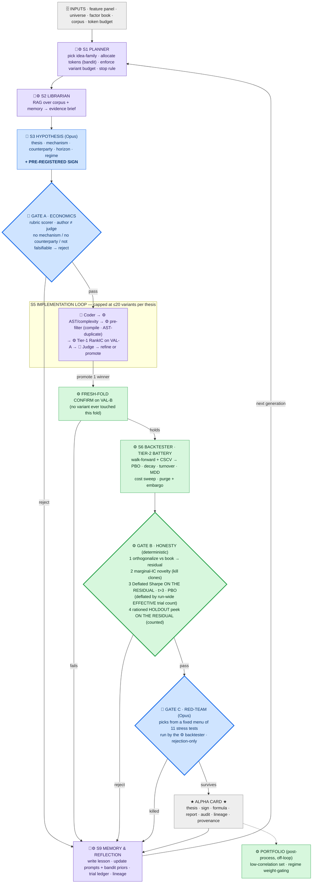

# Task B — Agentic AI Alpha Researcher: Design Document

> **Status:** design frozen. This is the canonical architecture doc and the source for the slides.
> Plain-English walkthrough → `FLOW_EXPLAINED.md`. Full decision record + dictionary → `PLAN_EXPLAINED.md`.
> Phased build spec → `IMPLEMENTATION_PLAN.md`.

---

## 0. Context

Trexquant Superday **Topic B**: *Design an AI agentic loop to produce robust alpha signals, and
explain how you would evaluate that system and improve it over successive iterations.*

- **Alpha signal** = a daily cross-sectional score: one number per stock per day, where the ranking
  across stocks predicts relative forward returns.
- **Assumed resources** (given): production data features · a backtesting environment · frontier LLM
  API with a **finite token budget** · a research literature corpus.
- **Assumed additionally** (stated per the prompt's allowance): an existing **production factor book**
  to measure novelty against; a **sealed holdout** region of history.
- **Graded on:** task specification (exact I/O; one finished output = economic thesis + alpha
  implementation) · agent roles and definitions · evaluation of the **system** · improvement over
  iterations · a **real example of a bad signal/thesis** and what we'd change.
- **Constraints:** no paid data. Prototyping recommended, not required — *"a clear design with a
  rigorous evaluation and improvement plan scores as highly as a demo."* Effort: a few focused hours.

The prompt's grading philosophy governs every scoping decision below: **"a partial result you
understand beats a complete one you cannot defend."**

---

## 1. Task specification — exact input and output

### Input

| Input | Form |
|---|---|
| Feature panel | stock × day × feature, point-in-time, ~10 OHLCV-derived fields + delivery-% + sector |
| Universe | **Top 200 Indian equities by trailing liquidity**, rebuilt monthly point-in-time from NSE daily bhavcopy (see §9) |
| Backtester | deterministic Python engine, parameterized (split · lag · cost · neutralization · subsample) |
| LLM API | finite token budget *B* |
| Research corpus | RAG index over papers + the system's own memory |
| Production factor book | the incumbent signals a candidate must add information to |
| Config | universe, train/val-A/val-B/holdout split, target metrics, holdout peek budget |

### Output — one **Alpha Card**

The finished, correct unit of work. Every accepted signal produces exactly one:

1. **Economic thesis** — mechanism · who is on the other side of the trade and why they persistently
   lose · why it is not already arbitraged away · expected horizon · regime dependence.
2. **Pre-registered prediction** — the **sign** and **horizon**, committed *before* any data is
   touched, hashed into the trial ledger with a timestamp.
3. **Alpha implementation** — a formula over the operator library producing one number per stock per
   day, with its AST.
4. **Backtest report** — IC · RankIC · ICIR · long-short return · Sharpe · turnover · MDD · decay
   curve over h ∈ {1,2,3,5,10,21}.
5. **Honesty audit** — marginal IC vs the book · Deflated Sharpe vs effective trial count · t-stat vs
   the 3.0 bar · PBO · which holdout peek was spent.
6. **Red-Team report** — which falsification tests were run, and the result of each.
7. **Verdict + lineage** — accept / revise / reject, plus the full family tree: which hypothesis,
   which parent formula, which edit, which generation.
8. **Data provenance line** — which fields the formula used (read off the AST leaves).

A **rejected** card is not discarded. It carries its death certificate into memory, and that is the
substrate for improvement across iterations.

---

## 2. Measurement contract

| Item | Decision |
|---|---|
| **Predict** | next-day (h=1) relative return · horizon is thesis-linked · decay curve over h ∈ {1,2,3,5,10,21} |
| **Output** | daily cross-sectional score — only the *ranking* matters |
| **Label** | next-day **cross-sectionally demeaned** (market-neutral) return |
| **Primary metric** | **RankIC** (report IC and ICIR alongside) |
| **Timing** | features ≤ close of day *t* → trade at *t+1* open → earn *t+1* open → *t+2* open |
| **Secondary** | quintile long-short · equal-weight · dollar-neutral · net of ~15 bps/side · cost sweep {5,15,30} + turnover — *robustness only, not the primary grade* |

RankIC is primary because the deliverable is a ranking and rank correlation is robust to the fat tails
in Indian mid-caps. Portfolio construction is deliberately **not** the primary grade: Task B defines
the deliverable as the cross-sectional score.

---

## 3. Architecture — nine stages



**Governing rule:** *agency where there is a **decision**; a deterministic tool where it is a **fixed
computation**.* All verdict math is code with a fixed threshold — un-gameable by construction. This is
the structural difference from naive "LLM-as-judge" systems.

### The nine stages

| # | Stage | Type | What it decides |
|---|---|---|---|
| **S1** | **Planner** | 🤖 cheap LLM + ⚙ bandit | which idea-family next · token allocation · variant budget · when to stop |
| **S2** | **Librarian** | ⚙ RAG + 🤖 brief | what the literature and our own memory already say about this family |
| **S3** | **Hypothesis** | 🤖 Opus | the economic thesis and the pre-registered sign |
| **S4** | **Gate A · Economics** | 🤖 mid LLM, author ≠ judge | does the thesis meet the rubric, or die before any code is written |
| **S5** | **Implementation loop** | 🤖 Coder + 🤖 Judge + ⚙ AST/pre-filter/Tier-1 | which formula best expresses this thesis (bounded search) |
| **S6** | **Backtester** | ⚙ one engine, 8 call sites | *(no decisions — computes)* |
| **S7** | **Gate B · Honesty** | ⚙ deterministic | is it new, and is it real after accounting for how hard we searched |
| **S8** | **Gate C · Red-Team** | 🤖 Opus + ⚙ test menu | which attacks fit this signal, and does it survive them |
| **S9** | **Memory & Reflection** | 🤖 Reflection + ⚙ ledger | what did we learn, and where should the next generation look |
| — | *Portfolio* | ⚙ post-process, off-loop | how the accepted book combines |

---

## 4. Component preservation ledger — 16 components inside 9 stages

Nothing was deleted. Nodes merged only where they share **one decision boundary and one state
object**. The main slide shows nine boxes; an appendix slide shows the sixteen components with their
paper lineage. Depth is one click away, not hidden.

| Stage | Absorbs | Capabilities retained |
|---|---|---|
| S1 Planner | Orchestrator 🤖 · Bandit ⚙ · stop-rule ⚙ | family selection · token allocation · elite mutation/crossover · stopping criteria · **variant-budget enforcement (new)** |
| S2 Librarian | RAG retrieval ⚙ · Brief writer 🤖 | corpus grounding · memory grounding · citation trail · crowding avoidance |
| S3 Hypothesis | Idea agent 🤖 | mechanism · counterparty · why-not-arbitraged · horizon · regime · falsifiable claim · **pre-registered sign** |
| S4 Gate A | Economics Reviewer 🤖 | hard rubric · author ≠ judge · sign hashed into the ledger |
| S5 Implementation | Coder 🤖 · AST/operator ⚙ · Pre-filter ⚙ · Tier-1 ⚙ · Judge 🤖 | operator library · AST · complexity control · compile check · **structural AST novelty** · fast validation RankIC · refinement critique · within-thesis search · **+ variant cap + fresh-fold confirm + full ledger logging (new)** |
| S6 Backtester | Tier-1 · Tier-2 · holdout · stress runs · portfolio · ablation | walk-forward · CSCV → PBO · decay · turnover/MDD/Sharpe · cost sweep · purge + embargo · **+ published interface and trial-counting rule (new)** |
| S7 Gate B | Novelty ⚙ · Stats Auditor ⚙ · holdout ration ⚙ | marginal IC vs book · Deflated Sharpe · t>3 · PBO · trial ledger · holdout budget · **+ reordered: novelty first, DSR on the residual (new)** · **+ the peek scores the residual too, and deflation uses the run-wide *effective* trial count (P6)** |
| S8 Gate C | Red-Team 🤖 · test menu ⚙ | all stress tests · agent-selects / tool-computes · **+ 2 new tests, labelled rejection-only** · **+ (P9) 5 decisive falsifiers always run — agent only adds diagnostics; test-4 kills on "unprofitable net, or Sharpe halved to <0.5"; regimes are the backtester's expanding-window labels; test 11 reads P1's `liquidity_ranks.parquet`** |
| S9 Memory | Reflection 🤖 · memory write ⚙ · ledger ⚙ | lessons · prompt updates · bandit priors · lineage graph · trial ledger |
| *off-loop* | Portfolio ⚙ | low-correlation synergistic set · regime weight-gating |

---

## 5. The four gates

| Gate | Type | Kills | Placement rationale |
|---|---|---|---|
| **A · Economics** | 🤖 LLM rubric scorer, author ≠ judge | no named mechanism · no counterparty · no reason it survives arbitrage · not falsifiable | **Before any code.** Cheapest possible rejection; also where the sign is committed |
| **Pre-filter** *(inside S5)* | ⚙ code | won't compile · over complexity cap · AST-duplicate of the zoo or memory | **Free**, so it runs first and costs zero trials |
| **B · Honesty** | ⚙ deterministic thresholds | redundant vs the book · fails Deflated Sharpe / t>3 / PBO on the residual | Ordered **novelty → statistics → holdout**, so a scarce holdout peek is never spent on a clone |
| **C · Red-Team** | 🤖 LLM selects, ⚙ tools compute | leakage · regime-dependence · cost fragility · micro-cap artefact | **Last**, because it only rejects — see §7 |

### Gate A rubric (all five required; missing any → reject)

1. Named mechanism.
2. Who the counterparty is and why they persistently lose.
3. Why it has not already been arbitraged away.
4. Horizon and regime.
5. A falsifiable prediction — including the **sign**.

Enforced by three teeth: (a) the rubric is hard, not advisory; (b) a **different** LLM instance scores
it adversarially — the author never grades itself; (c) the sign is **pre-registered** and later checked
against the realized sign. A signal that works only with the *opposite* sign to its story is a **thesis
failure, not a discovery**.

### Gate C — the fixed test menu (11)

The agent *chooses which tests fit this signal*; the tests are parameterized backtester runs, never
arbitrary LLM-generated code.

1. Per-year subsample · 2. Regime split (bull / bear / high-vol) · 3. **Size tercile** — by a
**trailing-turnover proxy**, *not* market cap: free sources give only the *current* share count, so
applying it to 2015 would silently use future information (buybacks, issuance). A leak-free stand-in
is the honest choice, and saying why is a small rigor point ·
4. Cost sweep {5, 15, 30 bps} · 5. **+1-day extra lag (global)** · 6. **`delivery_pct` +1-day shift**
*(new — the one field with genuine timing ambiguity)* · 7. Sector-neutralized variant ·
8. Liquidity filter · 9. Decay curve · 10. Sign-stability across folds ·
11. **Universe-edge sensitivity** *(new — re-run excluding the names ranked 150–200 by liquidity that
month; a signal that survives only on the fringe has a capacity problem)*.

**Survives** iff RankIC stays positive and significant across the core stresses and does not collapse
under the extra lag or realistic costs.

---

## 6. Five failure modes, five mechanisms — the core slide

The design's real content is knowing which mechanism catches which failure, **and which does not**.

| Failure mode | Caught by | Explicitly does **not** catch it |
|---|---|---|
| **Look-ahead / leakage** | Causal operator library (structural) · timing contract · purge + embargo · +1-day lag test · `delivery_pct` shift | **Deflated Sharpe and PBO.** A deliberately leaky oracle at Sharpe 35 survives both — Gençay, arXiv 2608.27734 |
| **Selection / multiple testing** | Deflated Sharpe vs *effective* trial count · PBO · **variant cap** · fresh-fold confirm · rationed holdout | Any amount of economic reasoning |
| **Story-fitting ("right answer, wrong reason")** | **Pre-registered sign** · counterparty rubric · author ≠ judge | IC, Sharpe, DSR — all pass happily |
| **Redundancy / crowding** | AST duplicate check (S5) + marginal IC vs the book (Gate B) | All of the above |
| **Regime / cost fragility** | Red-Team fixed menu | Everything measured in-sample |

**Formula-level look-ahead is structurally impossible in this design.** Every operator in the library
(`delay`, `ts_mean`, `ts_rank`, `correlation`) is trailing-window; `rank` and `scale` are same-day
cross-sectional. No operator can reach forward. This is precisely the *"feature space that excludes
look-ahead by construction"* that 2608.27734 argues for — and it is why we do not need a separate
access-control layer on top.

---

## 7. Search policy and the trial budget

### Two levels of search

- **Between hypotheses (semantic, few, expensive):** S1's bandit allocates token budget across
  idea-families; S3 generates the thesis. This sets the *prior* — where in factor space to look.
- **Within a hypothesis (syntactic, many, cheap):** S5 searches formula space. The thesis says "volume
  shock"; it does not say whether the window is 5, 10 or 20 days, whether to use raw volume, dollar
  volume or turnover, or how to interact with price direction. **Only data can answer that.**

Both are required. Ideate alone gives each thesis one arbitrary implementation — a silent
false-negative machine. Formula search alone is brute-force symbolic mining: thousands of trials, a
crushing deflation penalty, and no economic thesis, which fails the prompt's minimum output spec.

### Why the within-thesis search is where overfitting enters

If N candidates are all truly worthless, the *maximum* observed t-statistic among them grows of order
√(2 ln N). That expression is the asymptotic **ceiling**; the realised maximum sits about 0.5 below it,
so both numbers belong on the slide — the ceiling because it is the closed form everyone quotes, the
realised value because it is what a gate actually has to beat (Monte Carlo, 20,000 draws per N):

| Variants per thesis | √(2 ln N) — the ceiling | **Realised best t-stat** | **P(best t-stat > 3) from pure noise** |
|---|---|---|---|
| 1 | 0.00 | ~0.0 | 0.1% |
| 5 | 1.79 | 1.17 | 0.7% |
| **20** *(our cap)* | **2.45** | **1.87** | **2.7%** |
| 100 | 3.03 | 2.50 | 12.6% |
| **200** | **3.26** | **2.74** | **23.6%** |
| 500 | 3.53 | 3.04 | **49.1%** |

*(200,000 Monte-Carlo searches per row.)* **The last column is the whole argument.** At 500 variants a
pure-noise search clears the "t > 3" bar **half the time** — the bar carries no information at all. At
200 it is nearly one search in four. At our 20-variant cap it is 2.7%, which is a bar worth having.
Our own build hit this live: a best-of-40 noise winner arrived at Gate B with **t = −3.00** exactly.

And the pre-registered sign gives no protection here — every variant inherits the thesis's sign, so the
check passes trivially for all of them.

> **The deflator uses the realised quantity, not the ceiling.** The Deflated Sharpe's `E[max SR]` term
> (Bailey & López de Prado) tracks the true order statistic to ~0.03. Deflating by √(2 ln N) instead
> would be ~0.5 too harsh and would reject real signals — measured: a genuine signal found in 5 trials
> with **t = 7.07** scores **DSR 0.9952 (pass)** under Bailey-LdP, **0.6579 (reject)** under
> √(2 ln N). See `PLAN_EXPLAINED.md` **G19-UPDATE**.

### The three bindings that fix it

1. **Hard variant cap: ≤ 20 per thesis**, enforced by S1. Chosen so that the cluster-adjusted
   effective N leaves headroom for a genuine signal to clear t > 3.
2. **Every variant enters the ledger.** Deflation uses the count of variants tried *within its own
   thesis*, not only the global count. Near-identical ASTs are clustered so 20 tweaks of one formula
   do not count as 20 independent bets — the Deflated Sharpe already handles this via the dispersion
   of trial Sharpes.
3. **Fresh-fold confirmation.** The entire formula search runs on Train + **Val-A**. The promoted
   winner is confirmed on **Val-B**, which no variant ever touched. This converts within-thesis
   selection into a genuine out-of-sample check *for free* — no holdout peek spent.

This turns "we do formula search" from a liability into a rigor point: **bounded, disclosed, deflated,
and confirmed out-of-sample.**

### Which backtester runs count as a trial

Only runs used to **select** inflate the multiple-testing budget:

| Runs | Counts as a trial? | Why |
|---|---|---|
| Tier-1 across formula variants | **Yes** | You take the maximum — this is selection |
| Tier-2 on the promoted finalist | Yes (one) | Selection |
| Marginal-IC on the residual | Yes | Selection |
| Holdout peek | Counted separately, against a fixed budget | Irreplaceable |
| **Red-Team stresses, cost sweeps, lag tests** | **No** | **Rejection-only.** A filter that can kill but never promote cannot inflate the false-discovery rate, so it requires no deflation |

That last row is the answer to *"doesn't your Red-Team running 11 backtests per candidate blow up your
trial count?"* — no, and here is the principle why.

---

## 8. Three budgets — and the conflict between them

| Budget | Spent by | Is a backtest expensive here? | How we economize |
|---|---|---|---|
| **1 · LLM tokens** (the finite budget the prompt stresses) | S3 Hypothesis, S5 Coder + Judge, S8 Red-Team, S9 Reflection | **No** — a backtest is a Python call returning a small metrics dict, ≈ 0 tokens | Bandit funds productive families; the free pre-filter kills junk before we pay the Judge or Red-Team |
| **2 · Compute / wall-clock** | Running backtests | Barely for one factor; the Tier-2 CSCV battery is modestly heavier | Heavy CSCV only on finalists |
| **3 · Statistical integrity** (the multiple-testing budget) | *Every selecting backtest* = one trial; every holdout peek = a counted, irreplaceable event | **Yes, invisibly** | Variant cap · trial ledger → Deflated Sharpe · rationed holdout |

**The reason to filter cheaply before backtesting is budget #3, not #1 or #2.** Ten thousand reckless
backtests raise the deflation penalty for *every* signal in the run.

**The conflict — a design point we have not found stated in the literature.** Budgets #1 and #3 pull in
opposite directions. Token efficiency rewards finding the best candidate in *fewer* evaluations;
statistical integrity punishes you for *every* evaluation made along the way. Any technique that makes
search more sample-efficient at maximizing a noisy objective is, by the same token, more efficient at
overfitting. This is why MCTS is on the roadmap rather than in the loop (§13).

The flip side is our best argument: **theory-first, LLM-guided search tries fewer, smarter candidates
than brute-force genetic search → fewer trials → smaller deflation penalty → survivors are more
believable.** *(cf. López de Prado: "backtesting is not a research tool — it's a final confirmation.")*

---

## 9. Data — regions, universe, provenance

### Four time-ordered regions

```
|<-- TRAIN 3y -->|<----- VAL-A 3.5y ----->|<- VAL-B 1y ->|<=== HOLDOUT 3.5y ===>|
  warm-up + CSCV      formula search           the ONE          sealed · counted
  fold supply         plays here               promoted            peeks only
  (never selects)     (<=20 variants)          winner
```

| Region | Prototype dates | Role | Regimes covered |
|---|---|---|---|
| *(warm-up)* | 2014-01 → 2014-12 | lookback buffer only — never scored | — |
| **Train** | 2015-01 → 2017-12 (**3y**) | **warm-up + CSCV fold supply.** *Not* "where parameters settle" — formulaic alphas have hard-coded windows, nothing is fitted | demonetization (Nov 2016) |
| **Val-A** | 2018-01 → 2021-06 (3.5y) | the playground — every S5 variant is scored here | IL&FS/NBFC crisis 2018 · COVID crash + recovery 2020 |
| **Val-B** | 2021-07 → 2022-06 (1y) | **fresh fold** — only the promoted winner is scored here | 2021 bull top · start of the 2022 drawdown |
| **Holdout** | 2022-07 → 2025-12 (3.5y) | sealed lockbox; a fixed, counted number of peeks | rate cycle · 2023–24 rally |
| *(reserved)* | 2026 | live-forward check | — |

**Train is 3 years, deliberately.** Its honest job is (a) supplying the 252-day lookback buffer and
(b) contributing folds to the CSCV that produces PBO. It is **never used to select anything**. Five
years would have bought marginally better PBO; three years buys a longer Val-A, which is where the
search actually happens. Regime coverage is preserved either way.

Chosen so the regions straddle genuinely different regimes — 2016 demonetization, the 2018 credit
crisis, the 2020 COVID shock, the 2021 top, the 2022 rate cycle — giving the regime-robustness checks
real teeth.

**Purge + embargo in every split.** A forward return spans several days, so a naive cut lets test-period
labels leak into training. We **purge** training rows whose label window overlaps the test window and
**embargo** a gap after each test window. Without both, even a clean-looking split inflates IC.

**Why not a single validation set?** Because you select against it thousands of times and it silently
becomes a training set. Three defenses: Val-B is never selected against; CSCV replaces one split with a
*distribution* of OOS folds; and the holdout stays clean because only finalists touch it, each touch
counted against a fixed budget.

### Universe — top 200 by liquidity, rebuilt monthly, point-in-time

> **THE RULE.** On the last trading day of each month, using only data available that day: take every
> `SERIES == EQ` stock in the bhavcopy, require ≥252 days of prior history, rank by **median daily
> turnover over the trailing 63 days**, and take the **top 200** as the universe for the coming month.

**Naming we use everywhere, including the slides:** *"the 200 most liquid Indian equities,
reconstructed point-in-time from NSE daily bhavcopy."* **Not "NIFTY 200."**

**Why this is survivorship-free — and provably so.** Survivorship bias enters when the universe is
chosen using information about *who survived*. Both halves of this rule are blind to that. The ranking
uses trailing turnover as of date *D* — on 2018-03-15 DHFL was highly liquid, so it is in that month's
top 200, and its 2019 collapse is unknowable then. The source is a per-day exchange snapshot listing
whatever actually traded. **The dead names are never excluded, because nothing in the pipeline ever asks
whether a company still exists.** Exit is automatic: a stock leaves when it stops appearing in the daily
files — **the absence is the delisting.** There is no step where a human could get it wrong.

**Proof it worked:** plot universe size per day. A survivorship-biased panel **slopes upward** (recent
years look well-covered because those firms still exist); a correct one is **flat at 200 throughout**.
That chart is both the test and the disclosure slide.

### Why we abandoned the supplied index file — a verified finding

We planned to use a scraped NIFTY 200 constituent file (37 rebalances, 2015–2026). Verification proved
it unusable **as an index**:

- **80 of today's 200 NIFTY 200 constituents never appear in it at all** — RELIANCE, TCS, SBIN, MARUTI,
  TATASTEEL, TATAMOTORS, SUNPHARMA, TITAN, ULTRACEMCO, ONGC among them.
- **All 80 have zero inclusion/exclusion events.** That is the diagnostic signature: the file was built
  by replaying a change-log onto a base seed, so any stock already in the index before the log begins,
  and never subsequently churning, was never added. Permanent heavyweights fit exactly that profile.
  Each snapshot was then padded back to 200 with mid-caps — every row is a clean 200 while missing the
  largest names by weight.
- **21 of 36 rebalances are internally inconsistent** (declared inclusions/exclusions do not reconcile
  against the `symbols` deltas), ≈0.5–1.5% of the cross-section each.

**Replay cannot repair it.** Forward replay needs a correct 2015 base list — ours is the broken one.
Backward replay from NSE's current list needs a complete change log — ours is 21/36 inconsistent. NSE
publishes only the current constituent list, not historical snapshots.

**This is a presentation asset, not an embarrassment.** It is a real instance of the discipline the whole
system exists to enforce: we audited our own foundation, found it wrong in a way that would never have
thrown an error, and rebuilt from primary source.

### Features — OHLCV-only, by choice

Momentum · reversal · volatility · beta · Amihud illiquidity · turnover · 52-week-high distance ·
lottery/max-return · **NSE delivery-%** · **size proxy (trailing turnover)** · static sector.

**Fundamentals are excluded deliberately.** Free Indian fundamentals are not point-in-time (shallow,
restated, scraped), so using them would inject the very look-ahead this system exists to catch. This is
a **rigor choice, not an apology**; a PIT vendor (CMIE / Capitaline / Compustat) is "another month."

**Two timing facts to state on the slide:**
- **`delivery_pct` is published post-close on day *t*** (NSE `sec_bhavdata_full`, ~19:00 IST), i.e.
  *after* the close but *before* the *t+1* open. Under our trading contract it is therefore usable at
  **lag 0**. Publish time flagged for one-off verification. Red-Team test 6 stresses this directly.
- **Yahoo prices are retro-adjusted** for splits and dividends, so the historical series changes after
  a corporate action. Ratio-based features are scale-invariant and unaffected; price-*level* features
  are not. NSE bhavcopy is the cross-check, and is required anyway because Yahoo drops delisted names.

---

## 10. Evaluating the **system** (not the signal)

Grading one signal = the Alpha Card metrics. Grading the **factory** asks different questions:

| Dimension | Metric |
|---|---|
| **Yield** | fraction of hypotheses reaching an accepted card · **tokens per accepted alpha** · marginal IC added per generation · diversity of accepted alphas |
| **Honesty** | **FDR = accepted-but-fails-holdout ÷ accepted** · distribution of Deflated Sharpes · realized-vs-pre-registered sign agreement rate |
| **Efficiency** | real alpha per token — the headline objective |
| **Are the gates earning their place?** | **ablation** (below) |
| **Is it actually learning?** | **error-volume trend** (below) |

### Ablation — the answer to "isn't this over-engineered?"

Seed the pool with **known-good and known-junk** factors (random, deliberately overfit, deliberately
leaky). For each gate measure:
- **Catch rate** — junk correctly rejected.
- **False-kill rate** — good factors wrongly rejected.
- **Headline: FDR with the gate on vs off.** Disabling Gate B or Gate C should visibly raise FDR.

This makes complexity **self-justifying rather than asserted**: *we did not add gates because papers
have them; we measured what each one catches.* Corollary — and it is the real argument for pruning:
**we can only make this argument for gates we actually ablated.** Small-sample results in a prototype
are disclosed as illustrative.

### Detecting *fake* learning

*The Alpha Factory Illusion* (LLMQuant) shows factor-mining agents whose error **types** mature —
conceptual → operational → strategic — while the **total error volume barely moves**. That looks like
learning and is not. We therefore track **total rejections per generation and pass-rate per gate over
time**, not just the changing character of failures. A system that is genuinely improving shows falling
error *volume*; a system that is merely drifting shows the same volume in new clothes.

---

## 11. Improving over iterations

- **S9 Reflection** rewrites prompts and search priors from what actually worked.
- **S1's bandit** shifts token budget toward productive families and away from exhausted ones.
- **Memory** prevents rediscovering dead ends — stored as *edit motifs* (which change helped, under
  which parent-factor context), following AlphaMemo, rather than storing only final outputs.
- **Curriculum:** periodically inject adversarial regimes so only genuinely robust signals survive.
- **Meta-check with teeth:** if the holdout FDR creeps up, gate thresholds auto-tighten.
- **Stopping:** primary = token-budget exhaustion; secondary = diminishing returns (halt a family when
  K consecutive generations add < ε novelty-adjusted marginal IC); plus a hard generation cap.

---

## 12. Bad examples — the prompt asks for these

Three, spanning data, statistics and economics.

1. **Data integrity — a structurally broken universe source (real, found in our own data).** The
   supplied constituent file passes every superficial check: 37 snapshots, exactly 200 names each, dead
   companies retained. Yet **80 of today's 200 NIFTY 200 constituents never appear in it** — RELIANCE,
   TCS, SBIN, MARUTI, TATASTEEL, ONGC among them — every one with **zero inclusion/exclusion events**,
   the signature of a change-log replayed onto an incomplete base seed and padded back to 200 with
   mid-caps. The missing names are systematically the largest and most liquid in India, so every
   liquidity, size and capacity feature would have been silently biased. **Caught by external
   reconciliation against NSE's own list — not by any statistical gate.** DSR, PBO, purge/embargo and
   the lag test would all have passed it, because it contaminates the *universe* rather than any single
   factor. **Fix:** abandon constituent data; rebuild from daily bhavcopy as the top 200 by trailing
   turnover (§9).

2. **Statistical — look-ahead leakage.** A factor that lets same-day or forward information into the
   return window shows a spectacular fake Tier-1 RankIC, then is destroyed by purge + embargo and the
   Red-Team's +1-day-lag test. **The teaching point:** Deflated Sharpe and PBO would have passed it —
   leakage is caught structurally, not statistically (2608.27734).

3. **Economic — "right answer, wrong reason."** A data-mined signal passes naive IC but works only with
   the **opposite sign** to its stated thesis. Caught by the pre-registered-sign check. It is a thesis
   failure, not a discovery — and no purely statistical gate would have flagged it.

Each told as three beats: *naive result → the system catches it → the fix.*

---

## 13. What is genuinely novel — honest positioning

We re-checked our claims against the literature as of Sept 2026. Two of the four original headline
claims have been anticipated. Saying so, with citations, is stronger than defending them.

| Claim | Status | Position we take |
|---|---|---|
| **1 · Pre-registered sign + counterparty gate** | **Genuinely novel** | AlphaAgent does post-hoc hypothesis–factor *semantic alignment*; AgonAlpha's reviewer audits "sign logic" post-hoc. Nothing found **commits a direction before evaluation and rejects on mismatch**. This is our lead claim |
| **2 · Three budgets, and their conflict** | **Novel** | Token efficiency and statistical integrity pull in opposite directions. Not found stated anywhere; it is why MCTS is on the roadmap |
| **3 · Fixed-menu, rejection-only Red-Team** | **Differentiated** | Adversarial review exists (AgonAlpha's fresh-context reviewer with veto; FactorMAD's debate). Ours is a **fixed menu of parameterized backtests** — no arbitrary code, fully reproducible — and **rejection-only**, so it provably cannot inflate the trial count |
| **4 · Stat-rigor gates wired into fitness** | **Anticipated** — arXiv 2608.27734 | Not novel. Cite it, and lead instead with **what DSR does not catch**: their leaky oracle at Sharpe 35 survives DSR and PBO completely. Statistical gates are now table stakes; knowing their blind spot is the contribution |

---

## 14. Roadmap — what we would add next, and why not yet

| Extension | What it buys | Precondition |
|---|---|---|
| **LLM-guided MCTS formula search** *(Alpha Jungle, 2505.11122)* | A better formula per evaluation | Trial accounting validated first. MCTS concentrates sampling on the high-reward region — when the reward is noise it finds the tail *faster* than random search, and its adaptive draws make "effective number of independent trials" genuinely hard to define |
| **Code-based evolution** *(CogAlpha, 2511.18850; FactorMAD)* | Expressiveness beyond the operator set | A causal-operator sandbox and marginal-IC-primary novelty. Arbitrary Python is unbounded in complexity, weakens AST novelty, and **reopens the look-ahead surface** the operator library currently closes |
| **PIT fundamentals** *(CMIE / Capitaline)* | Whole new feature families | Vendor access — and this is when a per-field availability registry starts genuinely earning its keep |
| **Expanded operator library · full-scale evolutionary run · live-forward test** | Scale and an honest forward read | Time |

Sequencing is deliberate, not an omission: **get the meter working before attaching the multiplier.**

---

## 15. Scope of the deliverable

- **Design document** (this file) + **plain-English walkthrough** (`FLOW_EXPLAINED.md`) + **decision
  record** (`PLAN_EXPLAINED.md`).
- **Slide deck** — Problem / task spec → literature map → nine-stage architecture → the five-failure /
  five-mechanism slide → search policy and the three budgets → data audit and disclosure → evaluating
  the system + ablation → improvement loop → three bad examples → honest novelty positioning →
  roadmap.
- **Prototype (NIFTY 200)** — a faithful slice, not the whole design. Detailed implementation plan to
  be written separately once this design is signed off.

---

## 16. References

**Core LLM / agentic alpha frameworks** *(all verified against arXiv/ACM, Sept 2026)*
- **AlphaAgent** — LLM-Driven Alpha Mining with Regularized Exploration to Counteract Alpha Decay — [arXiv 2502.16789](https://arxiv.org/abs/2502.16789) (KDD'25). *Idea→Factor→Eval; AST originality; hypothesis–factor alignment; complexity control.*
- **R&D-Agent-Quant (RD-Agent(Q))** — Multi-Agent Framework for Data-Centric Factors and Model Joint Optimization — [arXiv 2505.15155](https://arxiv.org/abs/2505.15155), NeurIPS 2025, Microsoft Research. *Research→Development→Feedback; Co-STEER coder; multi-armed-bandit scheduler.*
- **QuantAgent** — Seeking Holy Grail in Trading by Self-Improving LLM — [arXiv 2402.03755](https://arxiv.org/abs/2402.03755). *Inner Writer↔Judge + outer KB loop.*
- **Automate Strategy Finding with LLM in Quant Investment** — [arXiv 2409.06289](https://arxiv.org/abs/2409.06289). *Multimodal generation; risk-varied ensemble; regime weight-gating.*
- **AlphaGen** — Synergistic Formulaic Alpha Collections via RL — [arXiv 2306.12964](https://arxiv.org/abs/2306.12964) (KDD'23).
- **FactorMAD** — Multi-Agent Debate for Interpretable Stock Alpha Factor Mining — Duan, Zhang & Li, ICAIF'25, pp. 605–613, [doi:10.1145/3768292.3770377](https://dl.acm.org/doi/10.1145/3768292.3770377).
- **AlphaMemo** — Structured Search-Process Memory for Self-Evolving Alpha Mining Agents — [arXiv 2606.20625](https://arxiv.org/abs/2606.20625). *AST-diff **edit motifs**; confidence-gated residual memory; asymmetric veto.*
- **FactorMiner** — Self-Evolving Agent with Skills and Experience Memory — [arXiv 2602.14670](https://arxiv.org/abs/2602.14670). *Skills / experience separation; Ralph loop.*
- **AlphaLogics** — [arXiv 2603.20247](https://arxiv.org/abs/2603.20247) · **AlphaCrafter** — [arXiv 2605.05580](https://arxiv.org/abs/2605.05580) · **QuantaAlpha** — [arXiv 2602.07085](https://arxiv.org/abs/2602.07085) · **QRAFTI** — [arXiv 2604.18500](https://arxiv.org/abs/2604.18500) · **PandaAI** — [arXiv 2606.06823](https://arxiv.org/abs/2606.06823) · **TradingAgents** — [arXiv 2412.20138](https://arxiv.org/abs/2412.20138) · **AlphaAgents** — [arXiv 2508.11152](https://arxiv.org/abs/2508.11152).

**Search, evolution, and budget**
- **AgonAlpha** — Autonomous Alpha Discovery via **Prompt Economy** and Scalable Agentic Search — [arXiv 2608.11250](https://arxiv.org/abs/2608.11250). *Fresh-context adversarial reviewer with re-execution + veto; pending-aware budget allocation. Notably uses **no** DSR/PBO/purge-embargo.*
- **Alpha Jungle** — Navigating the Alpha Jungle: an LLM-Powered **MCTS** Framework for Formulaic Factor Mining — [arXiv 2505.11122](https://arxiv.org/abs/2505.11122).
- **CogAlpha** — Cognitive Alpha Mining via LLM-Driven **Code-Based** Evolution — [arXiv 2511.18850](https://arxiv.org/abs/2511.18850).
- **QuantEvolve** — [arXiv 2510.18569](https://arxiv.org/abs/2510.18569) · **LLM-First Search** — [arXiv 2506.05213](https://arxiv.org/abs/2506.05213) · **AlphaEvolve** (DeepMind 2025) + **FunSearch** (Nature 2023).

**Statistical rigor and honest evaluation**
- **Deflated Sharpe Ratio** — Bailey & López de Prado — [SSRN 2460551](https://papers.ssrn.com/sol3/papers.cfm?abstract_id=2460551).
- **Harvey, Liu & Zhu** — "…and the Cross-Section of Expected Returns," RFS 2016 — the **t > 3** hurdle and the factor zoo.
- **López de Prado** — *Advances in Financial Machine Learning* — CPCV, purging and embargo, PBO.
- **"What survives honest evaluation? Leakage-safe, search-aware assessment of LLM-driven trading strategy discovery"** — [arXiv 2608.27734](https://arxiv.org/abs/2608.27734). ← **the leaky-oracle result: Sharpe 35 survives DSR and PBO.**
- **ValueBlindBench** — Agreement-Gated Stress Testing of LLM-Judged Investment Rationales — [arXiv 2604.25224](https://arxiv.org/abs/2604.25224). *How to validate that an LLM judge is not rubber-stamping.*
- **The Alpha Factory Illusion** — [LLMQuant](https://llmquant.substack.com/p/the-alpha-factory-illusion-why-your). *Error types mature while error volume does not — how to detect fake learning.*

**Surveys**
- *A Survey on LLM-based Alpha Mining* — [FITEE 10.1631/FITEE.2500386](https://link.springer.com/article/10.1631/FITEE.2500386) · *From Deep Learning to LLMs: AI in Quantitative Investment* — [arXiv 2503.21422](https://arxiv.org/abs/2503.21422) · *Integrating LLMs in Financial Investments* — [arXiv 2507.01990](https://arxiv.org/abs/2507.01990) · [Awesome-LLM-Quantitative-Trading-Papers](https://github.com/Tom-roujiang/Awesome-LLM-Quantitative-Trading-Papers).

**Classic alpha and data**
- Kakushadze — *101 Formulaic Alphas* — [arXiv 1601.00991](https://arxiv.org/abs/1601.00991) (operator-library basis).
- Data: [niftyhistory.in](https://niftyhistory.in/) (NIFTY 200 constituents) · NSE bhavcopy / `sec_bhavdata_full` · yfinance.
