# PLAN_EXPLAINED — A Plain-English Walkthrough of the Whole Design

> Purpose of this file: explain **everything** in `INITIAL_PLAN.md` in simple language — every
> vague term, every agent, and how the whole machine works end-to-end — so you can form your own
> opinion before we build anything. The original plan stays untouched; this is the "teacher's version."
>
> How to read it: Part 1 is the 60-second picture. Part 2 is a dictionary of every confusing word.
> Part 3 explains each of the 10 agents like you've never seen the plan. Part 4 walks one idea
> through the whole system with numbers. Part 5 explains our 4 "new" ideas. Part 6 explains how we
> grade and improve the system. Part 7 is the bad-example we must show. Part 8 is the honest FAQ.
>
> ### 📁 The three documents
> | File | What it is | Read it when |
> |---|---|---|
> | **`FLOW_EXPLAINED.md`** | Plain-English, start-to-finish narrative of the **final decided system** | **Start here** if you want to *understand* the machine |
> | **`INITIAL_PLAN.md`** | The architecture spec — nine stages, gates, evaluation, references. Slide source | When you're building the deck |
> | **`PLAN_EXPLAINED.md`** *(this file)* | The **decision record** — every doubt → decision → why — plus the dictionary, the detailed graph, and the honest FAQ | When you need *why* we chose something, or a term defined |
>
> **Status:** design **frozen**. Decision clusters **A–I** all resolved. Later clusters supersede earlier
> ones where marked — look for **UPDATE / SUPERSEDED** callouts, which deliberately keep the original
> text visible so the *reasoning trail* survives.

---

## DESIGN DECISIONS LOG (resolved doubts — pull these straight into the report/slides)

> A running log of decisions we've *settled*, so nothing gets re-litigated and a new reader/agent
> inherits the answer instead of the doubt. Format: **Doubt → Decision → Why.**

### Cluster B — the measurement contract (what we predict & how we grade it) — ✅ RESOLVED

- **B4 · Prediction horizon → next-day (h=1) is primary; horizon is a *thesis-linked* parameter;
  always plot the IC *decay curve* over h ∈ {1,2,3,5,10,21}.**
  *Why:* Topic B says "relative **forward** returns" (generic) while Topic A says "next-day," so
  next-day is the faithful default and yields the most independent observations. But "forward returns"
  leaves the door open, so the *economic thesis* sets the hold (microstructure reversal ≈ 1 day; drift
  / momentum ≈ weeks) and the decay curve justifies it empirically. Longer horizons are fully feasible
  on free daily OHLCV; the only extra care is overlapping returns, already handled by **purge+embargo**.

- **B5 · Output vs label, and the metric → Output = daily cross-sectional score (ranking only).
  Label = next-day cross-sectionally-demeaned (market-neutral) return. Primary metric = RankIC
  (report IC + ICIR too).**
  *Why:* the score is what we *produce*; we *grade* it against the realized **relative** return
  (demeaned each day → "beat your peers," not "market rose"). RankIC (rank correlation) is robust to
  the fat tails in Indian mid-caps.

- **B6 · Trade timing / look-ahead lag → features use only data ≤ close of day t; trade at t+1 open;
  return earned t+1 open → t+2 open.**
  *Why:* guarantees a clean gap between information used and money earned — no "bought at the same
  close that created the signal" look-ahead. Enforced automatically by purge+embargo. *(Headline rigor
  point for the report.)*

  > **B6-UPDATE (NEW) — the rule is now PER-FIELD, not one blanket sentence.** A single global rule
  > ("features ≤ close of day *t*") cannot be right for every field simultaneously — it is either too
  > loose for one or too tight for another. Resolved field by field:
  > | Field | Knowable at | Lag | Note |
  > |---|---|---|---|
  > | OHLCV + everything derived from it | *t* 15:30 IST | **0** | causal trailing windows only |
  > | `delivery_pct` | *t* ~19:00 IST (post-close) | **0** | before the *t+1* open → legitimately usable; Red-Team test 6 stresses it |
  > | `sector` | static | 0 | **not** PIT — reclassifications untracked; used only for optional neutralization. Disclosed |
  > | `in_universe` | effective date, applied 1–3 days late | 0 | **conservative** (see A2-AUDIT) |
  >
  > Probed by **Red-Team tests 5 (global +1-day lag)** and **6 (`delivery_pct` +1-day shift)**.

- **B7 · Portfolio construction & costs → NOT the primary grade (Task B grades the *signal*).
  Primary = RankIC/ICIR. Secondary robustness (Tier-2 / Red-Team only): quintile long-short,
  equal-weight, dollar-neutral, net of ~15 bps/side, cost sweep {5,15,30 bps} + turnover.**
  *Why:* the prompt defines the deliverable as the cross-sectional score, and the literature grades
  signals by IC/RankIC without a full costed portfolio. We keep a *light* costed long-short only to
  catch the "works gross, dies after costs" failure mode. Productionization options to mention:
  **TopK-Drop (Qlib)** and **feed into a LightGBM combiner** (as in AlphaAgent / RD-Agent).

### Cluster A — data reality (universe, survivorship, data sources) — ✅ RESOLVED

- **A1 · Universe → NIFTY 200**, code **sector-agnostic**. Real evaluation on the full ~200-name
  cross-section with **optional sector-neutralization** (demean score within sector each day) for
  like-with-like purity *without* shrinking breadth. **Financials (~35–45 names)** is the single-sector
  **dev smoke-test only**. *Why:* 200 names give enough breadth for stable RankIC and the t>3 /
  Deflated-Sharpe bars; single sectors (IT ~12, Pharma ~15) are too thin → noisy IC.

- **A2 · Survivorship → full near-PIT membership (UPGRADED — data in hand), NOT the time-intersection.**
  We obtained `nifty200_2015-01-01_to_2026-09-01.csv` from niftyhistory.in: **37 rebalances
  (2015-02 → 2026-03), exactly 200 constituents each, with inclusions/exclusions deltas**. Union =
  **315 unique symbols** (survivorship-bias-free universe); **115 "fallen" names** that rotated out are
  retained (DHFL, YESBANK, RCOM, JPASSOCIAT, SUZLON, IDEA, CAIRN, GRUH, CMC, COX&KINGS, …). We
  reconstruct **actual membership on any date** (each rebalance's `symbols` holds until the next). **Do
  NOT use the time-intersection** — it keeps only ever-present winners = *worse* survivorship. Residual
  gap = a *small, enumerable* set of fully-delisted names whose prices free sources may lack →
  **disclosed & quantified**. *Why:* near-PIT membership retains the disasters and isn't forward-looking.
  Remaining data work: map 5 special-char tickers + a few historical renames (CAIRN→VEDL, GRUH→Bandhan,
  CMC→TCS, BHARATFIN→INDUSIND), then pull OHLCV for the 315-symbol union.

  > #### 🔎 A2-AUDIT (NEW) — we checked the file instead of trusting it
  >
  > **1 · The dates are EFFECTIVE dates, not announcement dates — CONFIRMED.** This was the single
  > biggest correctness risk in the whole data stack, because NSE announces reconstitutions ~4 weeks
  > in advance. Had the file used *announcement* dates, we would have been holding stocks *because
  > they were about to join the index* — a real, profitable-looking, entirely untradeable effect that
  > **no statistical gate we own could ever catch**, because it contaminates the *universe itself*
  > rather than any one factor. Four independent checks say we are clean:
  > - the column is literally named `effective_date`;
  > - the semi-annual pattern from 2016 on is **end-of-March / end-of-September** = NSE's effective
  >   convention. Announcements cluster mid-Feb / mid-Aug and **nothing in the file sits there**;
  > - two direct spot checks — **Sept 2023**: NSE announced 17 Aug, effective 29 Sep; file says
  >   `2023-09-30`. **March 2024**: announced 28 Feb, effective 28 Mar; file says `2024-03-31`;
  > - **conclusive** — `2023-09-30` is a **Saturday** and `2024-03-31` a **Sunday**. NSE never
  >   announces on a weekend. These are normalized period-boundary dates.
  >
  > **2 · The source normalizes to calendar month-end**, so each new list is applied **1–3 trading
  > days late** vs NSE's true effective date (Sep 29 → Sep 30; Mar 28 → Mar 31). **Late is stale, not
  > future — conservative.** Trivial understatement of rebalance-day turnover. Disclosed, not fixed.
  >
  > **3 · Two genuine defects, quantified:**
  > - **21 of 36 rebalances are internally inconsistent**: the declared `inclusions`/`exclusions`
  >   columns don't reconcile against the actual deltas in the `symbols` column. Magnitude 1–3 names
  >   each ≈ **0.5–1.5% of the cross-section**, concentrated in renames/corporate actions (2023-09-30
  >   declares PIRAMAL out but ZTECH actually leaves; 2024-03-31 declares DELTACORP out but SDREAMS
  >   actually leaves). Worst: 2021-03-31 — declared 3 in / 3 out, actual 1 in / 1 out.
  >
  > **Response (SUPERSEDED — see A1/A2-UPDATE):** this file was abandoned entirely. 80 of today's 200
  > NIFTY 200 constituents never appear in it, all with zero events — a change-log replayed onto an
  > incomplete base seed. The universe is now built from bhavcopy by trailing turnover.
  >
  > **Why this matters for the presentation:** *"we audited our own universe file, found one phantom
  > constituent and ~1% residual inconsistency, fixed the former and quantified the latter"* is
  > exactly the maturity Task B tests for — and almost no candidate does it.

- **A3 · Features → OHLCV-only** (momentum, reversal, volatility, beta, Amihud illiquidity, turnover,
  52w-high distance, lottery/max-return) **+ NSE delivery-% + static sector**. **Fundamentals excluded**
  — free Indian fundamentals aren't point-in-time (shallow/restated/scraped/paid), so using them injects
  the very look-ahead our system exists to catch. Framed as a **rigor choice, not an apology**;
  PIT-fundamental vendor (CMIE/Capitaline/Compustat) = "another month."

  > **A3-TIMING (NEW) — two facts now pinned down:**
  > - **`delivery_pct` is published post-close on day *t*** (NSE `sec_bhavdata_full`, ~19:00 IST) —
  >   *after* the close but *before* the *t+1* open. Under our trading contract (B6) it is therefore
  >   usable at **lag 0**. Publish time flagged for one-off verification; **Red-Team test 6** stresses
  >   this field specifically, because it is the **only field in the panel with genuine timing
  >   ambiguity**.
  > - **Yahoo prices are retro-adjusted** for splits/dividends — the historical series *changes* after
  >   a corporate action. Ratio-based features are scale-invariant and unaffected; price-*level*
  >   features are not. NSE bhavcopy is the cross-check, and is needed anyway because Yahoo drops
  >   delisted names.

- **Data stack → prices: yfinance (Yahoo) primary** (~20y OHLCV, `.NS`) **+ NSE bhavcopy** as the
  official cross-check (adjustments, corporate actions, **delivery-%**). **Constituents:** niftyhistory.in
  / NSE `IndexInclExcl.xls`. *Caveat:* Yahoo is the most *accessible* free source, **not** the most
  *accurate* (bad ticks, adjustment quirks, **drops delisted names → doesn't fix survivorship**) — hence
  the NSE cross-check. **Build-time action:** hands-on verify the Jan-2015 list + niftyhistory.in access
  (automated fetch was 403-blocked).

### Cluster C — statistical rigor mechanics — ✅ RESOLVED

- **C8 · Trial counting → every distinct factor that touches the data counts as a trial (Tier-1
  included); deflate on the *effective* (cluster-adjusted) count.** Only counting Tier-2 finalists would
  massively under-deflate. Raw count over-penalizes 50 near-identical variants, so the Deflated Sharpe
  uses trial count *plus the variance/correlation of their Sharpes* (cluster near-duplicates via the
  AST/correlation we already compute). Identical re-runs dedupe to one (memory prevents re-testing).
  This is the concrete number behind "LLM-guided search tries fewer trials → smaller penalty."

  > **C8-UPDATE (NEW) — only runs used to SELECT count as trials.**
  > | Runs | Counts? | Why |
  > |---|---|---|
  > | Tier-1 across formula variants | **Yes** | you take the maximum → this *is* selection |
  > | Tier-2 on the promoted finalist | Yes (one) | selection |
  > | Marginal-IC on the residual | Yes | selection |
  > | Holdout peek | counted **separately**, against a fixed lifetime budget | irreplaceable |
  > | **Red-Team stresses · cost sweeps · lag tests** | **No** | **rejection-only** — a filter that can kill but never promote cannot inflate the false-discovery rate, so it needs no deflation |
  >
  > That last row answers *"doesn't your Red-Team running 11 backtests per candidate blow up your
  > trial count?"* — **no, and here is the principle why.**
  >
  > **Within-thesis, not only global:** deflation for a promoted finalist uses the count of variants
  > tried *inside its own thesis*, not just the run-wide total (see G19).
  >
  > **C8-UPDATE-2 (NEW, from the P6 verification pass) — "not only global" was implemented as "only
  > within-thesis", and that is a hole big enough to drive the whole failure mode through.**
  > The Orchestrator promotes the best card *across* theses, so the population the winner was
  > maximised over is the **run-wide** one. Scoping deflation to the thesis gives a brand-new thesis
  > **N = 1 → E[max SR] = 0 → no deflation whatsoever**, no matter how much search preceded it: spawn a
  > fresh thesis_id and the meter reads zero. **Fix: deflate on the effective count over the whole
  > ledger, with the within-thesis count kept as a floor; report both on the card.**
  >
  > Measured — 40 noise variants searched under 40 *different* thesis_ids, the winner then gated under
  > a fresh 41st thesis. Its raw t-stat is **−3.000**: it clears the naive `t > 3` bar from pure noise.
  >
  > | Deflation scope | effective N | E[max SR] | DSR | verdict |
  > |---|---|---|---|---|
  > | within-thesis only (the bug) | 1 | 0.0000 | 1.000 | **accept** ❌ |
  > | run-wide (the fix) | 41 | 0.0728 | 0.789 | **reject** ✅ |
  >
  > **A second, quieter bug in the same line:** the effective count was combined as
  > `max(effective, raw N)`. Since `effective ≤ N` by construction that is *always* raw N — the
  > cluster-adjustment of this very decision was computed and then thrown away. Measured: 20
  > knob-variants of one AST shape → effective **2.0**, but the DSR was being handed **20**. Fixed to
  > use the effective count directly. This is the number behind *"LLM-guided search tries fewer trials
  > → smaller penalty"*, so it has to actually reach the deflator.

- **C9 · CPCV vs walk-forward → prototype uses walk-forward as the workhorse + a small CSCV for one
  honest PBO number; full CPCV stays the production standard in the design.** Walk-forward (expanding
  window, sequential OOS) is simple, faithful to live use, and yields the OOS series for the decay/regime
  checks. PBO needs the combinatorial approach, so we add a small CSCV (~8–16 splits) purely to produce
  the headline PBO for the good-vs-bad demo. **Purge + embargo apply in both.**

### Cluster D — agent mechanics — ✅ RESOLVED

**Guiding principle: agency where there's a *decision*; a deterministic tool where it's a *fixed
computation*. Verdict math stays un-gameable code (our edge vs naive "LLM-as-judge" systems).**

- **D10 · Role → implementation split.**
  - **LLM agents (reason + call tools):** Idea/Hypothesis (**Opus**), Factor/Coder (**Sonnet**, Opus on
    hard cases), Red-Team/Refutation (**Opus** — chooses which attacks fit the signal), Reflection/Meta
    (**Sonnet**, periodic), Orchestrator *direction-setting* (**cheap LLM**), **Economics Reviewer /
    Gate-0** scorer (**mid LLM**, rubric + adversarial, author≠judge, **NEW**), **Librarian / Brief
    writer** (**cheap LLM**), **inner-loop Judge** (**Sonnet**, **NEW**).
  - **Deterministic tools / fixed graph nodes (NO LLM):** Backtester (IC/RankIC/ICIR/Sharpe/turnover/
    MDD/decay; walk-forward + CSCV), Stats Auditor (Deflated Sharpe, PBO, trial ledger, threshold
    verdict), Novelty/Crowding (AST-diff vs zoo/memory + orthogonalized marginal-IC), Portfolio optimizer
    (low-corr set, regime weight-gating), cheap pre-filter (compile/complexity/AST-dup), Orchestrator
    *budget* (bandit), RAG retrieval (vector search), Memory + trial-ledger store.
  - *Net:* **8 LLM agents 🤖 + 8 deterministic tools ⚙ = 16 components** (2 NEW agents: Economics
    Reviewer + inner-loop Judge; all original 10 roles kept). Concentrates
    frontier tokens on Idea + Red-Team → serves alpha-per-token; keeps truth-decisions un-gameable.
  - **Orchestration = LangGraph** (stateful cyclic graph: nodes = agents/tools, edges = gate routing,
    state = Alpha Card + memory + ledger; checkpointing for the outer loop; graph viz doubles as a slide).
    *Lighter alternative noted:* a thin custom Python orchestrator + Anthropic SDK if we want fewer deps.

- **D11 · Red-Team mechanics → selects from a fixed menu of *parameterized backtests* the Eval tool
  runs (no arbitrary code):** per-year subsample · regime split (bull/bear/high-vol) · market-cap
  tercile · cost sweep {5,15,30 bps} · +1-day extra lag · sector-neutralized variant · liquidity filter
  · decay curve · sign-stability across folds. **Survives** iff RankIC stays positive/significant across
  core stresses and doesn't collapse under +lag or costs. Safe + reproducible.

  > **D11-UPDATE (NEW) — the menu is now 11 tests.** Added:
  > **6 · `delivery_pct` +1-day shift** — the one field with genuine timing ambiguity (A3-TIMING). If
  > RankIC survives the *global* +1-day lag but collapses when only `delivery_pct` moves, we have
  > **localized** the dependency to a field whose availability needs re-verifying. Strictly more
  > diagnostic than a uniform shift: it names the culprit instead of just flagging that one exists.
  > **11 · Universe-edge sensitivity** — re-run excluding the names ranked 150-200 by liquidity that
  > month. A signal surviving only on the fringe of a liquidity-ranked universe has a capacity problem.
  > *(Originally "known-defect sensitivity", aimed at defects in the scraped index
  > file. That file was abandoned entirely — see A1/A2-UPDATE — so the test was repointed at the
  > liquidity edge, which is the live version of the same concern.)*
  >
  > **Also corrected: test 3 is a SIZE tercile, not a market-cap tercile.** Free sources supply only the
  > *current* share count, so applying it to 2015 would silently use future information (buybacks,
  > issuance). We use a **trailing-turnover proxy** instead — leak-free, and the substitution is itself
  > a small rigor point worth stating.
  >
  > Full menu: 1 per-year subsample · 2 regime split · 3 **size tercile (trailing-turnover proxy)** · 4 cost sweep {5,15,30 bps} ·
  > 5 global +1-day lag · **6 `delivery_pct` +1-day shift** · 7 sector-neutralized · 8 liquidity
  > filter · 9 decay curve · 10 sign-stability across folds · **11 known-defect sensitivity**.
  > All **rejection-only** → none of them counts as a trial (C8-UPDATE).

- **D12 · Economics Gate 0 made real (anti-rubber-stamp) → rubric + adversarial scorer + pre-registered
  sign (the teeth).** (1) **Hard rubric** — thesis must fill *all*: named mechanism · who's the
  counterparty & why they persistently lose · why not already arbitraged · horizon+regime · a
  falsifiable prediction; missing any → reject. (2) **Author ≠ judge** — a different LLM instance scores
  it adversarially. (3) **Pre-registered sign/horizon** committed *before* the backtest; Eval checks the
  realized sign matches — a signal that only works with the *opposite* sign to its story is a thesis
  failure, not a discovery.

### Cluster E — prototype demo & meta-evaluation — ✅ RESOLVED

- **E13 · Bad examples to feature → keep BOTH.**
  1. **Headline: look-ahead leakage** — a factor that lets same-day/forward info into the return window
     shows a *spectacular fake* Tier-1 IC, then is destroyed by **purge/embargo + the Red-Team's +1-day-
     lag** test. Showcases the timing discipline (B6) and the leakage machinery. 3-beat story: *naive
     result → system catches it → the fix.*
  2. **Second: "right answer, wrong reason"** — a data-mined signal that passes naive IC but only works
     with the **opposite sign** to its stated thesis; caught by D12's **pre-registered-sign** check (a
     thesis failure, not a discovery). Showcases the *economic* gate, not just the statistical one.
     *(Optional fourth: duplicate-of-momentum killed by marginal-IC ≈ 0.)*

  > **E13-UPDATE (NEW) — promote a THIRD, and make it the opener: a REAL defect in our own data.**
  > **3. Data integrity — a structurally broken universe source.** The supplied constituent file passes
  > every superficial check — 37 snapshots, exactly 200 names each, dead companies retained — yet **80
  > of today's 200 NIFTY 200 constituents never appear in it at all** (RELIANCE, TCS, SBIN, MARUTI,
  > TATASTEEL, ONGC...), every one with **zero inclusion/exclusion events**: a change-log replayed onto
  > an incomplete base seed, padded back to 200 with mid-caps. The missing names are systematically the
  > largest and most liquid in India, so every liquidity/size/capacity feature would have been silently
  > biased. **Caught by external reconciliation, not by any statistical gate** — DSR, PBO,
  > purge/embargo and the lag test would all have passed it, because it contaminates the *universe*
  > rather than any single factor. Exactly the lesson of the leaky-oracle result (2608.27734): some
  > failures are structural and no amount of statistics sees them. **Fix:** abandon constituent data;
  > rebuild from bhavcopy by trailing turnover (A1/A2-UPDATE).
  >
  > Final set = **data (broken universe) · statistics (leakage) · economics (wrong sign)** — one from
  > each failure family, each told in three beats: *naive result → the system catches it → the fix.*


---

### Search policy & optional code mode (added after the 2nd literature sweep) — ✅ DECIDED

- **Bandit and MCTS are complementary, not rivals** (MCTS's UCT *is* a bandit at each tree node). Use
  **two levels**: (a) **flat multi-armed bandit** at the Orchestrator to allocate token budget across
  idea-*families*; (b) **LLM-guided MCTS** [Alpha Jungle, arXiv 2505.11122] to search the
  *formula-refinement tree* within a hypothesis. **Memory's failure-lessons prime the node priors**
  (introspective search, I-MCTS).
  > ⚠️ **SUPERSEDED IN PART by G23.** The bandit-at-the-Orchestrator half stands. The *MCTS-as-primary-
  > formula-search* half is **moved to the roadmap**: "more sample-efficient" is true for the **token**
  > budget and **backwards for the statistical budget** — see G23 and PART 1.6.
- **Optional "code-based evolution" mode** [Cognitive Alpha Mining / CogAlpha, arXiv 2511.18850;
  AlphaEvolve]: evolve arbitrary Python instead of formulas — more expressive, higher overfitting risk.
  **Formulaic stays the safe default**; code mode is opt-in. ⚠️ **Also moved to the roadmap by G23.**

### Cluster F — architecture consolidation — ✅ RESOLVED (NEW)

- **F15 · Present the system as 9 STAGES, not 16 components — merges only, nothing dropped.**
  Merge rule: **two nodes merge only if they share one decision boundary and one state object.** Main
  slide = nine boxes; appendix slide = the sixteen components with paper lineage. Full preservation
  ledger in `INITIAL_PLAN.md` §4, walkthrough in `FLOW_EXPLAINED.md`.
  *Why:* the risk of a 16-box diagram isn't intellectual, it's **defensibility** — sixteen chances to
  answer *"what does that node buy you?"* weakly, in front of experienced researchers. The prompt's own
  grading philosophy is explicit: *"a partial result you understand beats a complete one you cannot
  defend."* Depth is one click away, not hidden.

- **F16 · Portfolio / Combination → moved OFF the loop, kept as a post-process.**
  *Why:* B7 already says portfolio construction isn't the primary grade, and the capability that matters
  *inside* the loop — "does this add information to the book?" — already lives in Gate B's marginal IC.
  Combination + regime weight-gating only bite once ≥3 alphas are accepted. **Nothing lost; re-placed.**

- **F17 · Inner-loop Judge → KEPT, scoped inside S5 as the Coder's critic.** Cheap model, one job:
  diagnose why the last variant failed and propose one edit. Call count capped by S1.
  *Why keep:* AlphaMemo's central finding is that the reusable knowledge is *which **edit motifs** work
  under which parent-factor context* — a Judge that names the motif is what feeds that memory.
  *Why scope:* every Judge call fires a Tier-1 backtest, which is a trial.

- **F18 · Orchestrator's LLM half → KEPT, merged into S1, cheap model.** *Why:* the bandit only chooses
  among *existing* families. Proposing a genuinely **new** family, and crossing elite theses, are
  semantic acts — there is a real decision there.

### Cluster G — search policy & the trial budget — ✅ RESOLVED (NEW)

- **G19 · Hard variant cap: ≤ 20 formula variants per thesis, enforced by S1.**
  *Why:* if N candidates are all worthless, the best observed t-stat grows like **√(2 ln N)** —
  **N=20 → 2.45 · N=100 → 3.03 · N=200 → 3.26.** At 200 variants the best formula clears the t>3 bar
  **by construction, from pure noise.** And the pre-registered sign gives **zero protection here**,
  because every variant inherits the thesis's sign so the check passes trivially for all of them. 20 is
  chosen so the cluster-adjusted effective N leaves headroom for a genuine signal. Every variant enters
  the ledger (C8).

  > **G19-UPDATE (NEW, measured in the P6 verification pass) — √(2 ln N) is a CEILING, not the expected
  > best t-stat.** It is the asymptotic upper bound on the maximum of N standard normals; the realised
  > maximum centres about **0.5 lower**, and it is the realised maximum a gate has to beat.
  > Monte Carlo, 20,000 draws per N:
  >
  > | N | realised E[max] | √(2 ln N) | Bailey-LdP E[max] |
  > |---|---|---|---|
  > | 5 | 1.168 | 1.794 | 1.193 |
  > | 20 | **1.868** | 2.448 | 1.901 |
  > | 200 | **2.744** | 3.255 | 2.766 |
  > | 500 | 3.038 | 3.526 | 3.053 |
  >
  > **This does not weaken the argument for the cap — it sharpens it.** The number that actually makes
  > the case is not the mean but the *tail*: **P(best-of-N pure-noise t-stat > 3)** = 2.7% at N=20,
  > 12.6% at N=100, **23.6% at N=200, 49.1% at N=500** (200k Monte-Carlo searches per point). At 500
  > variants the "t > 3" bar is a **coin flip against pure noise**; at our cap of 20 it is 2.7%, a bar
  > worth having. That is G19's justification stated as a probability rather than an average. What it changes is *which
  > number you deflate by*: the Deflated Sharpe uses the **Bailey-López de Prado `E[max SR]`** term,
  > which tracks the true order statistic to ~0.03. A √(2 ln N) deflator would be systematically ~0.5
  > too harsh and would **kill real signals** — measured: a genuine signal found in 5 trials with
  > **t = 7.07** scores **DSR 0.9952 (pass)** under Bailey-LdP and **DSR 0.6579 (reject)** under
  > √(2 ln N).
  >
  > **Wording for the write-up and slides:** say the best-of-N noise t-stat is "**of order** √(2 ln N)",
  > quote the ceiling (3.26 at N=200) *and* the measured realised value (**2.74**), and state that the
  > gate deflates by the tighter Bailey-LdP term. The headline demo is unchanged and undiminished:
  > **best of 200 pure-noise signals → raw t = 2.74 → DSR 0.477 → rejected.**

- **G20 · Fresh-fold confirmation — search plays on VAL-A; the promoted winner is confirmed on VAL-B,
  which no variant ever touched.** *Why:* this converts within-thesis selection into a genuine
  out-of-sample check **for free** — no holdout peek spent. A cap alone is a guess about the right
  number; a fresh fold alone doesn't bound the ledger. Together they're strong.

- **G21 · Gate B REORDERED → orthogonalize → novelty → statistics → holdout.**
  The old order ran Stats-Auditor *then* Novelty. Two problems:
  1. The stats step ends in a **rationed holdout peek** — the scarcest resource in the system — while
     the novelty check (a regression against the book) is essentially free and **already computed** in
     the Tier-2 battery. Under the old order you could burn an irreplaceable peek on a signal novelty
     was about to reject as a momentum clone. **Free filter that preserves a scarce resource goes first.**
  2. More importantly, `INITIAL_PLAN` already defined fitness as *"deflated, holdout-gated,
     **orthogonalized marginal** IC"* — **one composite object**. The old order silently split it into
     "deflate the raw IC, then separately look at marginal IC," which is **not the same thing**: a
     signal can survive deflation on its raw form and have nothing left after orthogonalization.
     **Correct object → compute the Deflated Sharpe on the *residualized* signal.**
  *Nuance we accept:* a strict "kill duplicates" rule would discard a near-clone that is genuinely
  *better* than the incumbent. Real books handle this by **replacement, not rejection** — if marginal
  IC ≈ 0 but standalone quality dominates, the right action is **swap**.

  > **G21-UPDATE (NEW, from the P6 verification pass) — the residual rule binds step 4 too, not only
  > step 3.** The build applied "compute on the residual" to the Deflated Sharpe and then handed the
  > **raw** signal to the rationed holdout peek. That reintroduces exactly the split G21 was written to
  > close, at the most expensive step in the system:
  > - a **partial clone** — real but small marginal IC, most of its raw IC explained by the book —
  >   clears novelty and statistics, then gets **confirmed on HOLDOUT by the very book it was supposed
  >   to be measured against**;
  > - and the "did it collapse out of sample?" check ends up comparing a **raw** holdout IC against a
  >   **residual** VAL IC — mixed units, so it can never bite.
  >
  > Measured on such a partial clone: raw holdout RankIC **0.0320** vs residual holdout RankIC
  > **0.0196**. Peeking on the raw signal overstates the surviving edge by **63%** — and spends an
  > irreplaceable peek to do it. **Fixed: step 4 scores the residual.** The card records
  > `holdout_scored_on: "residual"` so the choice is auditable rather than assumed.
  >
  > The general principle, worth one slide line: *"deflated, holdout-gated, orthogonalized marginal
  > IC" is one composite object — **every** step of Gate B has to be looking at the same object.*

- **G22 · Trial-counting rule made explicit** — see C8-UPDATE / C8-UPDATE-2. Selection inflates;
  rejection-only doesn't; and the count is **effective, run-wide**.

- **G24 · The honesty machinery gets audited the way a signal does (NEW, from the P6 verification
  pass).** Phase 6 shipped with **25 green tests and 8/8 acceptance criteria met**, and still had four
  statistical defects — and **three of the four leaned the same way: towards accepting things.**
  | # | Defect | Where it is now written down | Direction |
  |---|---|---|---|
  | A | Rationed peek scored the raw signal, not the residual | G21-UPDATE | **too permissive** |
  | B | Deflation scoped to the thesis, so a fresh thesis got none | C8-UPDATE-2 | **too permissive** |
  | D | `max(effective, raw N)` silently discarded the cluster adjustment | C8-UPDATE-2 | too *harsh* |
  | E | `σ_SR = 0` from identical trial SRs switched deflation off | `IMPLEMENTATION_PLAN` P6 step 3 | **too permissive** |

  (A fifth, an unbounded `id()`-keyed cache, was an engineering leak rather than a statistical one —
  `reports/p6_handoff.md` §5 finding C.)

  *Why this belongs in the decision log:* **a passing test suite proves the code does what the tests
  say, not what the design says.** Every one of these was invisible to the spec's acceptance criteria
  because those criteria test each statistic **in isolation**, while all four defects lived in **how the
  statistics were wired together** — which object the peek looks at, which population the deflator is
  charged against, whether the effective count reaches the deflator at all. The fix that generalises:
  for a gate, write at least one test per **load-bearing claim** ("the peek judges the same object the
  DSR judged", "deflation sees the run, not the thesis"), not only one per function. And a leaning
  matters more than a count: **defects that cluster on the permissive side are the ones this whole
  project exists to catch — in signals, and evidently in the build too.**

- **G23 · MCTS and code-based evolution → moved to the ROADMAP (supersedes part of the Search-policy
  entry above).**
  - **MCTS** (Alpha Jungle, 2505.11122): its entire value is *finding the maximum of the reward
    function in fewer evaluations.* When the reward is **noise**, that means **finding the tail of the
    noise faster than random search would.** Worse, MCTS draws are **adaptive** — each chosen from
    previous results — so "effective number of independent trials" becomes genuinely hard to define and
    the Deflated Sharpe's assumptions get shaky. **MCTS is a multiplier on search efficiency; get the
    meter working before attaching the multiplier.**
  - **Code-based evolution** (CogAlpha 2511.18850; FactorMAD): arbitrary Python is unbounded in
    complexity (memorization risk), weakens AST-based novelty (needs canonicalization, still weaker),
    and — decisively — **reopens the look-ahead surface** that the causal operator library currently
    closes. Given the leaky-oracle result (2608.27734), deliberately widening the leakage surface is
    the wrong first move.
  - **What stays in S5:** bounded greedy/evolutionary refinement — Coder proposes an edit, Judge
    critiques, ≤20 variants, all ledgered, winner confirmed on the fresh fold. Simple, deflatable,
    defensible.
  - *Nothing lost citation-wise* — both papers stay on the literature map **and** the roadmap slide.
    Stating the sequencing reason out loud reads as **judgement, not omission**.

### Cluster H — honest novelty positioning — ✅ RESOLVED (NEW)

- **H25 · Re-verify our own novelty claims and CONCEDE the ones already published.** A Sept-2026 sweep
  found two of the four original headline claims anticipated:

  | Claim | Status | Position |
  |---|---|---|
  | **Pre-registered sign + counterparty gate** | **Genuinely novel** | AlphaAgent does post-hoc semantic *alignment*; AgonAlpha audits "sign logic" post-hoc. Nothing found **pre-commits a direction and rejects on mismatch** → **our lead claim** |
  | **Three budgets & their conflict** | **Novel** | token efficiency and statistical integrity pull in *opposite* directions; not found stated anywhere |
  | **Fixed-menu, rejection-only Red-Team** | **Differentiated** | adversarial review exists (AgonAlpha's fresh-context reviewer with veto; FactorMAD's debate). Ours is a **fixed menu of parameterized backtests** (reproducible) and **provably cannot inflate the trial count** |
  | **Stat-rigor gates in the fitness function** | **ANTICIPATED** — arXiv 2608.27734 | already does trial ledger → DSR vs the search's own trial count → PBO, integrated into search |

  *Why concede rather than defend:* a researcher who knows 2608.27734 **will** ask, and *"this claim of
  mine was published last month, here's the citation, and here's what I claim instead"* is worth more
  than four unchallenged claims. It also hands us a **better** point — the same paper shows a
  deliberately **leaky oracle at Sharpe 35 surviving DSR and PBO completely**, proving statistical gates
  are the *wrong tool* for leakage. **Different failures need different mechanisms, and knowing which is
  which is the contribution.**

### Cluster I — what we deliberately did NOT build — ✅ RESOLVED (NEW)

- **I26 · No feature registry / access-control layer. Considered in depth, rejected on the analysis.**
  - **Access control is redundant with the compile check.** Our panel is ~10 columns we build ourselves
    from OHLCV. Reference anything not in it and the code throws a `KeyError` at the pre-filter — free.
    **The panel *is* the whitelist.**
  - **Formula-level look-ahead is already structurally impossible.** Every operator in the Alpha101-style
    library (`delay`, `ts_mean`, `ts_rank`, `correlation`) is trailing-window; `rank`/`scale` are same-day
    cross-sectional. **No operator can reach forward.** This *is* the *"feature space that excludes
    look-ahead by construction"* that 2608.27734 recommends — we already have it.
  - **The per-field lag engine reduces to one field.** Everything is lag 0 except `delivery_pct`. So
    "per-feature lag stress" is **one test on one field** — kept, as **Red-Team test 6** — not an engine.
  - **A registry wouldn't have caught the broken universe source anyway.** It records *"these are
    effective dates"*; it does not verify who the constituents are. **External reconciliation** caught
    that. So the higher-value spend was the **universe audit** — which we did.
  - **Where the content went instead:** the decisions log. **B6-UPDATE** resolves timing per field,
    **A2-AUDIT** carries the findings, **D11-UPDATE** carries the two new Red-Team tests. **Zero new
    artifacts, zero new nodes.**

  *Why record a rejected idea:* an inert gate on a slide invites *"what has that ever caught?"* — a
  question with no good answer.

### Infrastructure — free LLM API (build-time) — ✅ DECIDED

- **Primary: Groq (free, no credit card).**
  > ⚠️ **UPDATE (T3):** `llama-3.3-70b-versatile` and `llama-3.1-8b-instant` were reportedly
  > **deprecated 17 June 2026** (sources conflict with Groq's own models page). **Do not hard-code a
  > model ID** — read from config and probe availability at startup, walking a fallback chain:
  > reasoning roles `openai/gpt-oss-120b` → `qwen/qwen3-32b`; cheap roles `openai/gpt-oss-20b`.
- **Reasoning agents** (Hypothesis, Red-Team) get the large model; **Coder, Judge, Reflection, Planner,
  Brief, Economics Reviewer** get the small fast one.
- **RAG embeddings:** local `sentence-transformers` (offline, free). **Zero-limit offline fallback:**
  **Ollama** (Qwen2.5-7B / Llama-3.1-8B) local.
- **Everything is swappable** via LangChain integrations; route per node.
- > ⚠️ **BUDGET REALITY (T3).** Free-tier limits are **per organisation** (extra keys do not multiply
  > capacity) and **tokens-per-day binds before requests-per-day**: large models 100–200K TPD, small
  > 200–500K TPD, at 6,000–12,000 TPM. **Measured ~16.6 calls and ~26,500 tokens per thesis**, so a
  > 50-thesis run is ~2× over on both. **~20 theses is the practical daily ceiling**, and throttling
  > alone puts that at ~74 min wall clock. Requires: token-bucket throttle, static-prefix prompts so
  > the rubric caches, short Judge/Coder prompts, and a clean `BudgetExhausted` into P10's checkpoint.
- **Disclosure for slides:** open free models reason a notch below frontier → theses slightly weaker;
  *"swap in a frontier API in production"* is the trivial upgrade.

**✅ All doubts (clusters A–I) resolved + infra + search policy chosen. This log is the canonical record — pull from it for the report/slides.**

---

## PART 1 — The 60-second picture

**What Trexquant asked (Topic B):** Don't hand us one trading signal. Instead, **design a factory
run by AI agents** that keeps *inventing* trading signals, *testing* them, *throwing out the bad
ones*, and *getting better over time*. Then tell us how you'd **measure** that factory and **improve** it.

**What is the product the factory makes?** A **daily cross-sectional alpha signal.** Unpack that:
- **Signal / score:** one number for each stock, each day.
- **Cross-sectional:** the number only matters *relative to the other stocks today*. It is a ranking.
  We are not predicting "will the market go up." We are predicting "which stocks will beat which."
- **Alpha:** the part of a stock's return you can predict/skill, above just riding the market.
- So each day you produce a column of numbers: Reliance = +1.2, TCS = −0.4, Infosys = +0.7 …
  High number = "I expect this to outperform its peers tomorrow." You buy the top-ranked, short the
  bottom-ranked, and you profit if your ranking was right *on average across many stocks and days*.

**Our factory in one line:** a team of specialized AI agents (idea-maker, coder, tester, skeptic,
librarian, memory-keeper, manager) runs in a **loop**: propose an idea → turn it into a formula →
backtest it → attack it → keep it only if it survives every check → remember what happened →
propose a better idea next time. A finite LLM budget forces it to be economical.

**Why we can beat a naive version:** most published systems are good at *generating* lots of
formulas but weak at *not fooling themselves*. Our design's headline additions are all about
**not being fooled**: hard statistics gates, a dedicated skeptic agent, an "explain the economics
or it's rejected" rule, and a budget-aware manager that spends tokens where they pay off.

---

## PART 1.5 — The whole system as a flowchart

Read it top-to-bottom: data + budget come in at the top; an idea flows down through the agents; it
must survive **four gates** (economics, statistics, novelty, red-team); survivors become an **Alpha
Card** and join the population; everything (pass or fail) is logged to memory, which feeds the next
generation. The finite token budget governs how much work happens at all.

**Legend — every node is explicitly typed so a LangGraph builder knows exactly what to implement:**
- 🤖 **AGENT** = an LLM node (prompt + optional tool-calling) — **spends tokens** *(blue)*.
- ⚙ **TOOL** = a deterministic Python function / tool node with a fixed output — **~0 tokens**; a
  gate-tool also applies a **fixed threshold** and routes the edge *(green)*.
- 🗄 **DATA** = a data store / artifact *(grey)*.

**Rule the whole design obeys:** *agency where there is a **decision**; a deterministic tool where it
is a **fixed computation**. All verdict math is a TOOL with a fixed threshold → un-gameable.*

```mermaid
flowchart TD
    %% LEGEND: agent(blue)=LLM, spends tokens; tool(green)=deterministic code ~0 tokens; data(grey)
    subgraph INPUTS["🗄 Inputs / Assumed Resources"]
        D1["Feature panel · point-in-time"]:::data
        D2["Backtester = deterministic ⚙ tool"]:::data
        D3["LLM API · finite TOKEN budget"]:::data
        D4["Research corpus"]:::data
        D5["Existing production factor book"]:::data
    end
    INPUTS --> M1
    M1["🤖 1 Orchestrator / Planner (AGENT · cheap LLM)<br/>choose idea-family / research direction"]:::agent
    M1 --> BND["⚙ 1b Bandit scheduler (TOOL · used by Orchestrator)<br/>allocate LLM token budget across families"]:::tool
    BND --> RAG["⚙ 2a Librarian · RAG retrieval (TOOL)<br/>vector search over corpus + memory"]:::tool
    RAG --> BRIEF["🤖 2b Librarian · Brief writer (AGENT · cheap LLM)<br/>summarize the retrieved evidence into a brief"]:::agent
    BRIEF --> IDEA["🤖 3 Researcher / Idea (AGENT · Opus)<br/>economic thesis + hypothesis + PRE-REGISTERED sign / horizon"]:::agent
    IDEA --> G0{"🤖 GATE 0 · Economics Reviewer (NEW AGENT · scorer · author≠judge)<br/>rubric: mechanism · counterparty · why-not-arbitraged · falsifiable?"}:::agentGate
    G0 -- fails rubric --> REJ["⚙ Reject + log to memory (TOOL)"]:::tool
    G0 -- passes --> CODER["🤖 4 Coder (AGENT · Sonnet)<br/>hypothesis → formula via operator library + AST"]:::agent
    CODER --> PRE{"⚙ PRE-FILTER (TOOL · free · structural half of Novelty #7)<br/>compiles? complexity? AST-duplicate vs zoo/memory?"}:::toolGate
    PRE -- junk / duplicate --> REJ
    subgraph INNER["Inner loop — only the Judge spends tokens"]
        PRE -- ok --> T1["⚙ 5 Eval / Backtest · TIER-1 on VAL-A (TOOL)<br/>fast IC / RankIC / ICIR · ~0 tokens · counts as a TRIAL<br/>≤ 20 variants per thesis — cap enforced by the Planner"]:::tool
        T1 --> JUDGE{"🤖 inner-loop Judge (NEW AGENT · Sonnet · refines the Coder)<br/>matches hypothesis + pre-reg sign? promising vs memory?<br/>names the EDIT MOTIF for memory"}:::agentGate
        JUDGE -- refine --> CODER
    end
    JUDGE -- "promote 1 winner" --> FF{"⚙ FRESH-FOLD CONFIRM on VAL-B (TOOL · NEW)<br/>no variant ever touched this fold →<br/>turns within-thesis selection into an honest OOS check, free"}:::toolGate
    FF -- fails --> REJ
    FF -- holds --> T2["⚙ 5 Eval / Backtest · TIER-2 RIGOR (TOOL · finalists only)<br/>full IC · RankIC · ICIR · Sharpe · turnover · MDD · decay<br/>+ walk-forward + small CSCV → PBO + regime / cost sweeps<br/>+ ORTHOGONALIZE vs book → residual · purge+embargo"]:::tool
    T2 --> G7{"⚙ GATE B-1 · Novelty / Crowding (TOOL) — NOW FIRST<br/>marginal-IC of the residual vs the book<br/>(free · runs before any holdout peek is spent)"}:::toolGate
    G7 -- copy / redundant --> REJ
    G7 -- "original + adds IC" --> G6{"⚙ GATE B-2 · Stats Auditor (TOOL · deterministic threshold)<br/>Deflated Sharpe ON THE RESIDUAL vs effective trial-count<br/>· t&gt;3 · PBO → rationed HOLDOUT peek (counted)"}:::toolGate
    G6 -- fail --> REJ
    G6 -- pass --> G8{"🤖 GATE C · Red-Team / Refutation (AGENT · Opus)<br/>picks from a FIXED MENU of 11 stress tests → run by ⚙ backtester<br/>subsample · regime · size-tercile · costs · +1-day lag<br/>· delivery_pct shift · sector-neutral · liquidity · decay<br/>· sign-stability · universe-edge — ALL REJECTION-ONLY (not trials)"}:::agentGate
    G8 -- killed --> REJ
    G8 -- survives --> OUT["★ ALPHA CARD ★ (output artifact)<br/>thesis + pre-reg sign + formula + report + audit<br/>+ red-team report + lineage + data provenance"]:::data
    OUT -.-> PORT["⚙ 10 Portfolio / Combination (TOOL · OFF-LOOP post-process)<br/>low-corr synergistic set · regime weight-gating"]:::tool
    REJ --> REFLECT["🤖 9 Historian / Reflection (AGENT · Sonnet)<br/>write lesson + EDIT MOTIF → update prompts + bandit priors"]:::agent
    OUT --> REFLECT
    REFLECT --> MEMW["⚙ Memory write (TOOL)<br/>structured search-process memory + trial ledger"]:::tool
    MEMW --> POP[("🗄 Population / Memory (data store)<br/>elites + lessons + ledger")]:::data
    REFLECT -- next generation: mutate / crossover elites --> M1
    OUT -.-> POP
    POP -.-> RAG
    POP -.-> M1

    classDef agent fill:#cfe4ff,stroke:#1f6feb,color:#08306b;
    classDef tool fill:#d7f7dd,stroke:#2da44e,color:#08341a;
    classDef data fill:#eeeeee,stroke:#888888,color:#222222;
    classDef agentGate fill:#cfe4ff,stroke:#1f6feb,color:#08306b,stroke-width:3px;
    classDef toolGate fill:#d7f7dd,stroke:#2da44e,color:#08341a,stroke-width:3px;
```



**Node inventory — the LangGraph build sheet (nothing here is optional; all capabilities retained):**

| # | Node | Type | Impl / model | Tokens | LangGraph node kind |
|---|------|------|--------------|:------:|---------------------|
| 1a | **Orchestrator** / Planner | 🤖 Agent | cheap LLM | small | LLM node |
| 1b | Bandit scheduler | ⚙ Tool | code (UCB / Thompson) | 0 | function / tool node |
| 2a | **Librarian** · RAG retrieval | ⚙ Tool | vector search | 0 | tool node |
| 2b | **Librarian** · Brief writer | 🤖 Agent | cheap LLM | small | LLM node |
| 3 | Researcher / Idea | 🤖 Agent | **large model** | yes | LLM node |
| G0 | **Economics Reviewer (NEW)** | 🤖 Agent (scorer) | mid LLM · author≠judge | yes | LLM node → conditional edge |
| 4 | Coder | 🤖 Agent | small/fast | yes | LLM node (+ code tool) |
| PRE | Pre-filter (Novelty #7 structural half) | ⚙ Tool | code (compile / AST-dup) | 0 | conditional edge / fn |
| T1 | Eval · Tier-1 backtest | ⚙ Tool | backtester on **VAL-A**, ≤20 variants | 0 | tool node |
| J | **inner-loop Judge (NEW)** | 🤖 Agent | small/fast | yes | LLM node → loop edge |
| FF | **Fresh-fold confirm (NEW · G20)** | ⚙ Tool | backtester on **VAL-B** | 0 | conditional edge / fn |
| T2 | Eval · Tier-2 rigor | ⚙ Tool | backtester + CSCV + **orthogonalize** | 0 | tool node |
| G7 | Novelty / Crowding — **now FIRST** | ⚙ Tool | code (marginal-IC of residual) | 0 | conditional edge / fn |
| G6 | Stats Auditor — **now SECOND** | ⚙ Tool | code (DSR **on residual** / PBO / ledger / holdout ration) | 0 | conditional edge / fn |
| G8 | Red-Team | 🤖 Agent | **large model** (+ backtester tool, 11-test menu) | yes | LLM node + tool calls |
| 10 | Portfolio — **OFF-LOOP** | ⚙ Tool | optimizer (post-process) | 0 | tool node |
| 9 | Reflection / Historian | 🤖 Agent | small/fast | yes | LLM node |
| Mem | Memory + Trial ledger | ⚙ Tool / store | DB / graph state | 0 | graph state + checkpoint |

**Roster & count: 8 LLM agents 🤖 + 8 deterministic tools ⚙ = 16 components**
(orchestrated by LangGraph; the `reject` sink + edge-routers are graph plumbing, not counted; the
**Backtester is one engine** shown as two nodes — Tier-1 & Tier-2 — plus fresh-fold and Red-Team runs).
- **🤖 Agents (8):** ① Orchestrator · ② Librarian (Brief writer) · ③ Idea · **④ Economics Reviewer — Gate 0** · ⑤ Coder · **⑥ inner-loop Judge** · ⑦ Red-Team · ⑧ Reflection.
- **⚙ Tools (8):** ① Bandit budget · ② RAG retrieval · ③ Pre-filter · ④ **Backtester engine** · ⑤ Stats Auditor · ⑥ Novelty / Crowding · ⑦ Portfolio · ⑧ Memory + trial-ledger.
- **All original 10 roles kept.** The **2 NEW agents** — *Economics Reviewer* and *inner-loop Judge* —
  were **added**, nothing swapped out.

> ### 🎯 SLIDE OVERLAY (F15) — present these 16 as **9 STAGES**
> This detailed graph stays the **build sheet and appendix slide**. The *main* slide is nine boxes,
> because sixteen boxes = sixteen chances to answer *"what does that node buy you?"* weakly. **Nothing
> is dropped — nodes merge only where they share one decision boundary and one state object.**
>
> | Stage | Merges these nodes | The one decision it owns |
> |---|---|---|
> | **S1 Planner** | Orchestrator 🤖 + Bandit ⚙ + stop-rule ⚙ | which family next · token + **variant** budget · when to stop |
> | **S2 Librarian** | RAG ⚙ + Brief writer 🤖 | what the literature *and our memory* already say |
> | **S3 Hypothesis** | Idea 🤖 | the thesis **and the pre-registered sign** |
> | **S4 Gate A · Economics** | Economics Reviewer 🤖 | does the thesis meet the rubric — before any code |
> | **S5 Implementation loop** | Coder 🤖 + AST/operator ⚙ + Pre-filter ⚙ + Tier-1 ⚙ + Judge 🤖 | which formula best expresses this thesis (**≤20 variants**) |
> | **S6 Backtester** | T1 · FF · T2 · holdout · stress · ablation | *(none — it computes)* |
> | **S7 Gate B · Honesty** | orthogonalize ⚙ + Novelty ⚙ + Stats ⚙ + holdout ration ⚙ | is it **new**, and is it **real** given how hard we searched |
> | **S8 Gate C · Red-Team** | Red-Team 🤖 + 11-test menu ⚙ | which attacks fit *this* signal |
> | **S9 Memory & Reflection** | Reflection 🤖 + memory write ⚙ + ledger ⚙ | what did we learn; where next |
> | *(off-loop)* | Portfolio ⚙ | how the accepted book combines |
>
> Full preservation ledger → `INITIAL_PLAN.md` §4. Plain-English walkthrough → `FLOW_EXPLAINED.md`.

**ASCII fallback ([A]=LLM AGENT, [T]=DETERMINISTIC TOOL, [D]=DATA):**

```
 Finite LLM TOKEN budget governs ONLY the [A] steps; every [T] backtest is ~free in tokens but is a TRIAL.

 [D] INPUTS: feature panel · backtester[T] · research corpus · factor book · LLM API(token budget)
                                   |
   [A] 1 ORCHESTRATOR pick family --> [T] BANDIT allocate token budget <---------------------+
                                   |                                                          |
   [T] LIBRARIAN·RAG retrieval --> [A] LIBRARIAN·BRIEF writer --> [A] 3 RESEARCHER thesis+hyp+SIGN
                                   |                                                          |
              [A] GATE 0 ECONOMICS REVIEWER (author≠judge) --fails--> reject[T]                |
                                   | passes                                                   |
                     [A] 4 CODER  formula + AST                                                |
                                   |                                                          |
        [T] PRE-FILTER compiles? complexity? AST-duplicate? --junk--> reject[T]                |
                                   | ok                                                       |
  ~~ INNER LOOP (<=20 variants/thesis) ~~                                                      |
      [T] TIER-1 backtest on VAL-A (fast RankIC · ~0 tokens · EACH RUN COUNTS AS A TRIAL)      |
      --> [A] JUDGE match hypothesis+sign? name the EDIT MOTIF? --refine--> back to CODER      |
                                   | promote ONE winner                                       |
   [T] FRESH-FOLD CONFIRM on VAL-B -- no variant ever touched this fold --fails--> reject      |
                                   | holds                                                    |
   [T] 5 TIER-2 RIGOR (finalists): full battery + walk-forward + CSCV->PBO + regime/cost       |
       + ORTHOGONALIZE vs book -> residual, over TRAIN+VAL-A, purge+embargo                    |
                                   |                                                          |
   [T] GATE B-1 NOVELTY (NOW FIRST): marginal-IC of residual vs book --copy--> reject          |
                                   | original + adds IC                                       |
   [T] GATE B-2 STATS: Deflated Sharpe ON THE RESIDUAL vs eff. #trials · t>3 · PBO             |
                       --> rationed HOLDOUT peek (counted)         --fail--> reject            |
                                   | pass                                                     |
   [A] GATE C RED-TEAM: picks from a FIXED MENU of 11 tests, run by [T] backtester             |
                        REJECTION-ONLY -> none of these count as trials  --killed--> reject     |
                                   |                                                          |
            all rejects  --> [A] 9 REFLECTION write lesson + motif --> [T] memory + ledger ----+
                                   | survives all gates
                              ★ ALPHA CARD ★ [D]  -----.
                                   |                    `--> [T] 10 PORTFOLIO (OFF-LOOP post-process)
                                   |                          low-corr set · regime weight-gating
```

**The four gates — and whether each is an AGENT or a TOOL (read this before wiring the graph):**
- **Gate 0 · Economics — 🤖 AGENT (LLM rubric scorer, author≠judge):** rejects before any code if the
  thesis lacks mechanism / counterparty / falsifiable prediction; the **sign is pre-registered here**.
- **Novelty (split): structural = ⚙ TOOL pre-filter** (AST-duplicate vs zoo/memory + complexity) *before*
  Tier-1; **statistical = ⚙ TOOL Gate B-1** (marginal-IC vs the book) inside Tier-2.
- **Gate B · Honesty — ⚙ TOOL (deterministic threshold), a 4-step sequence (REORDERED, G21):**
  ① orthogonalize vs the book → residual · ② **novelty first** (marginal-IC; free, so it runs before any
  scarce resource is spent) · ③ Deflated Sharpe **on the residual** vs effective trial-count, t>3, PBO
  from the CSCV paths · ④ only then a **rationed holdout peek**. Un-gameable by construction.
- **Gate C · Red-Team — 🤖 AGENT:** *chooses* the falsification tests from a **fixed menu of 11**; the
  tests themselves **run on the ⚙ backtester**. **Rejection-only → none of its runs counts as a trial.**
- **FRESH-FOLD CONFIRM — ⚙ TOOL (G20):** sits between the inner loop and Tier-2. The formula search
  plays on **VAL-A**; the single promoted winner must hold on **VAL-B**, which no variant ever touched.

**LangGraph wiring in one line:** *nodes* = the agents/tools in the inventory; *edges* = the pass/fail
routing out of each gate (**conditional edges**); *state* = the Alpha Card + memory + trial-ledger,
**checkpointed each generation** so the outer evolutionary loop can resume. Only 🤖 nodes spend tokens.

---

## PART 1.6 — What actually costs what (three separate budgets)

A backtest is a **Python computation**, not an LLM call — the agent fires a tool call and reads back a
tiny metrics summary (`IC=0.04, Sharpe=1.4`). So a backtest costs **~0 tokens**. The design therefore
tracks **three different budgets**, and it is a mistake to conflate them:

| Budget | Spent by | Is a backtest expensive here? | How we economize |
|---|---|---|---|
| **1. LLM tokens** (the finite budget the prompt stresses) | Idea reasoning, Coder, Judge, Red-Team, Reflection | **No** — backtest ≈ 0 tokens | Bandit spends tokens on productive families; cheap pre-filter kills junk before we pay the Judge/Red-Team |
| **2. Compute / wall-clock** | Running backtests | **Barely** for one factor; the *Tier-2 CSCV/PBO battery* is modestly heavier | Run heavy CSCV only on finalists |
| **3. Statistical integrity** (the multiple-testing budget) | *Every* selecting backtest = one **trial**; every **holdout peek** = a precious, counted event | **Yes, invisibly** | Variant cap · ledger counts trials → Deflated Sharpe; **holdout is rationed** |

**Key insight:** the reason to filter cheaply *before* backtesting is **not** tokens or compute — it's
budget #3. Ten thousand reckless backtests inflate the overfitting penalty for *every* signal. This
flips into an argument *for* our approach: **LLM-guided, theory-first search tries fewer, smarter
candidates than brute-force genetic search → fewer trials → smaller deflation penalty → survivors are
more believable.** (See López de Prado: *"backtesting is not a research tool — it's a final
confirmation."*)

> ### ⚔️ THE CONFLICT (headline novelty #2) — budgets #1 and #3 pull in OPPOSITE directions
> **Token efficiency rewards you for finding the best candidate in *fewer* evaluations. Statistical
> integrity punishes you for *every* evaluation you made getting there.**
>
> So any technique that makes search more **sample-efficient at maximizing a noisy objective** is, by
> the identical mechanism, more efficient at **overfitting**. Concretely: if N candidates are all
> worthless, the best observed t-stat grows like **√(2 ln N)** — **N=20 → 2.45 · N=200 → 3.26.** At 200
> variants you clear the t>3 bar **from pure noise**. A smarter search reaches that extreme with *fewer*
> draws, and its **adaptive** draws make "effective number of independent trials" hard to even define.
>
> This is *why* MCTS is on the roadmap rather than in the loop (G23), and why the **variant cap (G19)**
> and **fresh-fold confirm (G20)** exist. **We have not found this tension stated in any paper** —
> AgonAlpha (2608.11250) optimizes prompt economy without DSR/PBO; 2608.27734 does the statistics
> without the token-budget framing. Naming the conflict, and sequencing around it, is our contribution.

---

## PART 1.7 — What we backtest ON: the data split

The two tiers of backtest read **clearly separated data**, or we fool ourselves. History is cut into
**time-ordered regions** (never shuffled across time):

- **Train** — earliest chunk. ⚠️ **Corrected job: warm-up lookback buffer + CSCV fold supply. Nothing is
  fitted here and it never selects anything.**
- **Validation (development OOS)** — the **playground**; hit repeatedly during search.
- **Holdout / Lockbox** — most recent chunk; **sealed**, touched only by finalists a **counted** number of times.

**Which tier reads which data:**
- **Tier-1 (every candidate, cheap):** fast RankIC on **Val-A**. A *proxy to refine & rank* — it can
  **never accept** a signal on its own. Every Tier-1 run still counts as a **trial**.
- **Tier-2 (finalists only, rigorous):** **CPCV/CSCV** over **Train+Val-A** → many out-of-sample fold
  paths → a **distribution** → lets us compute **PBO** and a Deflated Sharpe reflecting the true trial
  count. If it clears, **one rationed peek at the sealed Holdout** = the honest final number.

**Why not just one validation set?** Because you select against it thousands of times and it silently
**becomes a training set.** Three defenses: Val-B is never selected against; CSCV replaces the single
split with a *distribution* of OOS folds; and the Holdout stays clean because only a handful of
finalists touch it, each touch counted against a fixed **holdout budget**.

**The leakage fix daily alpha must have — purge + embargo.** Because a forward return spans several
days, a naive cut lets test-period returns leak into training. In **every** split we **purge** training
rows whose label window overlaps the test window, and **embargo** a small gap after each test window.
Skipping this inflates IC even on a "clean-looking" split.

> ### 🔀 UPDATE (G20) — VALIDATION IS NOW SPLIT IN TWO
> The single validation window had a hole: **the formula search selects against it up to 20 times per
> thesis**, so the "winner" is partly a winner *because of* that selection. Fix — split it:
>
> ```
> |<---- TRAIN ---->|<--- VAL-A --->|<- VAL-B ->|<====== HOLDOUT ======>|
>    factor settles    formula search   the ONE      sealed · counted
>                      plays here       promoted        peeks only
>                      (≤20 variants)   winner is
>                                       confirmed here
> ```
>
> **VAL-B is never selected against** — only the single promoted winner is ever scored on it. That
> converts within-thesis selection into a genuine out-of-sample check **for free**, without spending a
> holdout peek. Cap (G19) bounds the ledger; fresh fold (G20) validates the pick. Neither alone suffices.

**Prototype split — FINAL:**

| Region | Dates | Length | Job | Regimes |
|---|---|---|---|---|
| *(warm-up)* | 2014-01 → 2014-12 | 1y | lookback buffer only, never scored | — |
| **Train** | 2015-01 → 2017-12 | **3y** | **warm-up + CSCV fold supply** | demonetization (Nov 2016) |
| **Val-A** | 2018-01 → 2021-06 | 3.5y | search plays here (≤20 variants) | IL&FS/NBFC 2018 · COVID 2020 |
| **Val-B** | 2021-07 → 2022-06 | 1y | **fresh fold** — winner only | 2021 top · 2022 drawdown start |
| **Holdout** | 2022-07 → 2025-12 | 3.5y | sealed · counted peeks | rate cycle · 2023–24 rally |
| *(reserved)* | 2026 | — | live-forward check | — |

> ### ⚠️ TRAIN SHRUNK TO 3 YEARS — and its stated job corrected
> **The old label was wrong.** The plan said Train is *"where the factor and any in-factor parameters
> settle."* For hard-coded formulaic alphas **nothing is fitted** — the Coder picks the windows, the
> data doesn't. Claiming a role the region doesn't play is exactly what a reviewer picks at.
>
> **Train's two honest jobs:** ① supply the **252-day lookback buffer** so a rolling feature can be
> computed on day 1 of Val-A; ② contribute **CSCV folds** for the PBO estimate. **It never selects
> anything.**
>
> **Why 3 and not 5:** the extra two years bought only marginally better PBO. Moved into Val-A they buy
> a much longer search window that now spans *two* stress regimes (2018 credit crisis **and** COVID).

---

## PART 1.8 — The measurement contract (one-glance summary)

| Item | Decision |
|---|---|
| **Predict** | next-day (h=1) relative return · horizon is thesis-linked · decay curve over h ∈ {1,2,3,5,10,21} |
| **Output** | daily cross-sectional score — only the *ranking* matters |
| **Label** | next-day **cross-sectionally-demeaned** (market-neutral) return |
| **Primary metric** | **RankIC** (+ IC, ICIR) |
| **Timing** | features available before the trade → trade **t+1 open** → earn t+1 open → t+2 open |
| **Secondary check** | quintile long-short · equal-weight · dollar-neutral · net of ~15 bps/side + turnover — *Tier-2 / Red-Team only*, not the primary grade |

---

## PART 1.9 — How it runs in LangGraph (implementation walkthrough)

**LangGraph = 4 ideas.** (1) **State** — one shared `TypedDict` that travels the whole run; every node
reads it and returns a merge-in update (the shared whiteboard). (2) **Node** — a function
`f(state)→update` that is *either* a 🤖 LLM call *or* a ⚙ plain function (same signature — that's why
agents and tools slot in identically). (3) **Edge** — normal edge = always A→B; **conditional edge** =
a router that reads state and returns the next node's name (this is how gates route pass/reject and how
loops turn back). (4) **Compile + checkpointer** — saves state each step so the outer evolutionary loop
can pause/resume.

**State (the whiteboard):** `budget_tokens_left · family · bandit_stats · candidate(AlphaCard) ·
variant_count · population(elites) · memory(lessons) · ledger(trials+Sharpes) · accepted(book)`. An
**AlphaCard** = thesis · hypothesis · pre_registered_sign · horizon · formula/AST · tier1_metrics ·
fresh_fold_metrics · tier2_metrics · audit · novelty · redteam_verdict · verdict · lineage.

**Nodes (each = a flowchart node; 🤖 agent / ⚙ tool):** `orchestrate`🤖(+⚙bandit) → `retrieve`⚙ → `brief`🤖 →
`ideate`🤖 → `gate0_economics`🤖 → `code`🤖 → `prefilter`⚙ → `tier1`⚙ → `judge`🤖 → **`freshfold`⚙** →
`tier2`⚙ → **`gate7_novelty`⚙ → `gate6_stats`⚙** *(reordered — G21)* → `gate8_redteam`🤖 → `reflect`🤖 →
`should_continue`⚙.  *(`portfolio`⚙ is now an **off-loop post-process**, not a graph node — F16.)*

**Two loops (LangGraph cycles):** *Inner* = `code→prefilter→tier1→judge→(refine)→code…` until promote,
capped at 20. *Outer* = `…→reflect→should_continue→orchestrate…`, one pass per evolutionary generation;
stops on budget exhaustion / diminishing marginal-IC.

**Agent-uses-tool (Red-Team):** the `gate8_redteam` LLM node loops *inside itself* — pick a stress test
from the fixed menu → call the ⚙ backtester tool → read numbers → next test or verdict. Agent decides
*what*; tool computes. (Same for Coder ↔ AST/compile tool.)

**Skeleton (the actual build):**
```python
from langgraph.graph import StateGraph, END
g = StateGraph(AlphaResearchState)
for name, fn in NODES.items(): g.add_node(name, fn)
g.set_entry_point("orchestrate")
g.add_edge("orchestrate","retrieve"); g.add_edge("retrieve","brief"); g.add_edge("brief","ideate")
g.add_conditional_edges("gate0",   route, {"pass":"code","reject":"reflect"})
g.add_edge("code","prefilter")
g.add_conditional_edges("prefilter",route, {"ok":"tier1","reject":"reflect"})
g.add_edge("tier1","judge")
# INNER loop — capped at <=20 variants per thesis (G19); every tier1 run is a TRIAL
g.add_conditional_edges("judge",     route, {"refine":"code","promote":"freshfold"})
# G20 — the ONE winner must hold on VAL-B, a fold no variant ever touched
g.add_conditional_edges("freshfold", route, {"holds":"tier2","fails":"reflect"})
g.add_edge("tier2","gate7")                                    # tier2 also ORTHOGONALIZES -> residual
# G21 — novelty FIRST (free), stats SECOND (spends the scarce holdout peek)
g.add_conditional_edges("gate7",     route, {"pass":"gate6","reject":"reflect"})
g.add_conditional_edges("gate6",     route, {"pass":"gate8","reject":"reflect"})
g.add_conditional_edges("gate8",     route, {"survive":"reflect","reject":"reflect"})
g.add_conditional_edges("reflect",  should_continue, {"continue":"orchestrate","stop":END}) # OUTER loop
app = g.compile(checkpointer=SqliteSaver(...))
# portfolio() runs ONCE over the accepted book after the graph terminates (F16) — not a node.
```

---

## PART 2 — Dictionary of every vague term

**Alpha** — Return you earn from *skill/prediction*, not from simply being exposed to the market.

**Cross-sectional** — "Across the set of stocks at one point in time." A cross-sectional score ranks
today's stocks against each other. Opposite of "time-series."

**Signal / factor / alpha** *(used interchangeably)* — A rule that assigns each stock a number each day.

**Forward return** — The return that happens *after* the day you made the prediction.

**Universe** — The set of stocks we're allowed to trade. ⚠️ **Ours is now the top 200 by trailing
liquidity, rebuilt monthly from NSE bhavcopy — not the NIFTY 200.** See A1/A2.

**Feature panel** — A 3-D table: stocks × days × features.

**Point-in-time (PIT)** — Using only information *actually available on that date*.

**Look-ahead bias** — Accidentally letting the strategy "see the future." Two kinds: **formula-level**
(the expression peeks forward — impossible for us, see operator library) and **data-level** (the feature
itself wasn't knowable on its stamped date — the kind we audit for).

**Survivorship bias** — Testing only on companies that still exist, silently dropping the bankrupt and
delisted. Makes any strategy look better than reality.

**Backtest** — Replaying history: "if I had used this signal every day, what would have happened?"

**IC (Information Coefficient)** — Each day, correlate predicted scores with actual next-day returns
across stocks; IC = the *average* of that daily correlation. 0 = useless. **0.03–0.05 is already good.**

**RankIC** — IC using *ranks* (Spearman). Robust to outliers. If IC is good but RankIC is bad, a couple
of extreme stocks are doing all the work — a warning sign. **Our primary metric.**

**ICIR** — Consistency of the IC: average IC ÷ its standard deviation. IC 0.03 *every* day beats +0.20
half the time and −0.14 the rest.

**Long-short return** — Buy the top-ranked, short the bottom-ranked. The "money" version of IC.

**Sharpe ratio** — Profit per unit of risk. 1 is decent, 2 very good, **3+ suspicious for a single
simple signal.**

**Turnover** — How much you must trade daily to hold what the signal wants. High turnover = high costs.

**MDD (Maximum Drawdown)** — Worst peak-to-trough loss. Great returns with an 80% drawdown are untradeable.

**Alpha decay / crowding** — Signals weaken as more people trade them. **Crowded** signals decay fast
and blow up together. Originality is our defense.

**Overfitting** — Building a signal that fits the past *by luck* rather than a real cause.

**Multiple testing / the "factor zoo"** — The more signals you try, the more likely one looks great by
pure luck. Test 1,000 worthless ideas at 5% significance and ~50 pass. The fix: raise the bar as you
test more.

**t-statistic** — How many standard errors a result sits from zero. Old rule t > 2; because of the
factor zoo, **Harvey–Liu–Zhu argue for t > 3** for new factors.

**√(2 ln N) — the selection-maximum rule** — If N *worthless* signals are tested, the best one's t-stat
is expected to be about √(2 ln N). **N=20 → 2.45 · N=100 → 3.03 · N=200 → 3.26.** This is why the
variant cap exists: at 200 variants you clear t>3 with no signal at all.

**Deflated Sharpe Ratio (DSR)** — A *corrected* Sharpe punishing you for (a) how many strategies you
tried and (b) lumpy returns. Answers: *"given how hard I searched, is this still impressive?"*
**Crucially, it does not catch leakage** — see the leaky-oracle result (2608.27734).

**PBO (Probability of Backtest Overfitting)** — The chance the strategy that looked best in-sample is
actually *below median* out-of-sample. A red flag for the whole search, not one signal.

**Trial / multiple-testing ledger** — A running count of every signal evaluated. Feeds the DSR. Only
runs used to *select* count; rejection-only runs (Red-Team) do not (C8).

**FDR (False Discovery Rate)** — Of the signals we *accepted*, what fraction were junk? **Our headline
system-level metric.**

**Train / validation / holdout** — *Train*: build. *Validation*: tune and compare. *Holdout*: the sacred
final exam, touched as little as possible.

**Val-A / Val-B (fresh fold)** — Our split of validation in two. **Val-A** is the playground where every
variant is scored. **Val-B** is never selected against — only the promoted winner is tested there (G20).

**Lockbox / holdout budget** — A *fixed, counted* number of peeks. Once spent, no more.

**Purge & embargo** — The fix for time-leakage. **Purge** = drop training rows whose label window
overlaps the test period. **Embargo** = skip a small gap after each test window.

**CPCV / CSCV** — Instead of one train/test split, slice history into N groups and hold out many
*combinations*. Yields a *distribution* of OOS paths — which is what makes PBO estimable.

**Two-tier backtesting** — **Tier-1** = fast RankIC on Val-A, every candidate (can never *accept*).
**Tier-2** = the rigorous battery on finalists only, ending in a rationed holdout peek.

**Orthogonalization / marginal IC** — Remove the part explained by existing factors, and ask whether the
*leftover* still predicts. That leftover is the **marginal IC** — the *new* information. We compute the
DSR **on that residual** (G21).

**AST (Abstract Syntax Tree)** — A formula written as a tree. Comparing two formulas' trees rigorously
answers "are these structurally the same idea?" Used for duplicate detection and complexity.

**Alpha101 / operator library** — A public set of 101 formulaic alphas built from operators (`rank`,
`delay`, `ts_mean`, `correlation`, `scale`). **Every operator is causal** — none can look forward —
which is why formula-level look-ahead is structurally impossible for us.

**Formulaic alpha** — A signal expressed as a math formula from those operators. Interpretable and
auditable, unlike a black-box net.

**Economic thesis / mechanism / "who is on the other side"** — The *story* for *why* a signal works.
**The other side** = who is losing money to you and why they keep doing it. No mechanism and no
counterparty ⇒ probably a coincidence.

**Pre-registered sign** — The direction of the predicted effect (`+1`/`−1`), committed **in writing and
hashed before any data is touched**. Realized sign must match, or the candidate is rejected as a
**thesis failure** (not "flip it and keep it"). *Why:* the sign is free — every factor `f` has a mirror
`−f` — so without pre-commitment you (a) silently double your trial count and (b) let the model
**retro-fit** a plausible story to whatever the data showed, turning the graded "economic thesis" into
narration of noise. **Bonus:** having committed, a **one-sided test** is legitimate — rigor that *buys*
power. **Limit:** it gives **zero** protection *inside* a thesis, since all 20 variants inherit the same
sign — which is what the variant cap is for.

**Variant cap** — The hard limit (**≤ 20**) on formula variants per thesis (G19).

**Rejection-only filter** — A gate that can **kill** but never **promote**. Such filters **cannot inflate
the false-discovery rate**, so their runs need no deflation. The entire Red-Team is rejection-only.

**Edit motif** — The *kind* of change made to a formula (widen the window · add a `rank` · swap volume
for turnover). AlphaMemo's finding: the reusable knowledge is **which motifs work in which context**.

**Leaky oracle** — From arXiv 2608.27734: a deliberately contaminated strategy posting **Sharpe 35**
that **survives DSR and PBO completely.** Proof that statistical gates are the wrong tool for leakage.

**Fake learning** — Error *types* mature while total error *volume* stays flat. Looks like improvement
and isn't (E14b).

**Regime** — A market environment: bull/bear, high-vol/calm. **Regime-conditioned validation** = check
each separately. **Regime weight-gating** = lean on signals suited to current conditions.

**Capacity** — How much money a signal absorbs before your own trading kills the edge.

**LLM / token / token budget** — LLMs read and write in "tokens" (~¾ of a word). A **finite** budget
means the factory must screen cheaply and think expensively only on promising leads.

**RAG** — Retrieve relevant documents first, then reason from real sources rather than fuzzy memory.

**Multi-armed bandit** — Balancing **exploiting** options that have paid with **exploring** untried ones.
Our manager uses it to choose which *idea-families* get the next tokens.

**Chain-of-thought (CoT)** — Prompting the model to reason step by step before answering.

**Inner loop / outer loop** — **Inner** = cheap polishing of one idea (S5). **Outer** = evolving a
*population* across generations (S1→S9→S1).

**Evolutionary search / population / mutation / crossover / elite** — Keep a **population**, score it,
keep the best (**elites**), make new ones by **mutating** or **crossover**, repeat over **generations**.

**Fitness function** — The single score the search maximizes. Ours: **deflated, holdout-checked,
novelty-and-orthogonality-adjusted marginal IC** — "new, honest, non-lucky predictive power."

**Lineage / provenance** — The family tree of a signal: which hypothesis, parent, edit, generation.

**Knowledge base / structured memory** — "What we tried and what happened," so the factory doesn't
rediscover dead ends. This is what makes it self-improving.

**Ablation** — Turn a component *off* and measure how much worse things get. Proves it earns its keep.

---

## PART 3 — The 10 agents, each explained from scratch

Think of it as a small research firm. Each "agent" is the same LLM given a **different job, different
instructions, and different tools.**

> **NOTE (F15):** all ten roles are **retained in full**. On the *main* slide they are presented as
> **nine stages** (see the Slide Overlay in Part 1.5) — this section is the appendix that opens each
> stage up. Two roles changed *position*, not substance: **Novelty now runs before the Stats Auditor**
> (G21) and **Portfolio moved off the loop** (F16).

### Agent 1 — Orchestrator / Planner  *(the manager)*  [from RD-Agent]
- **Receives:** the overall goal ("find new alphas that add to our book"), the remaining token budget,
  and the running scoreboard of which idea-families have paid off.
- **Does:** decides *what to work on next* and *how much budget to spend*. It groups ideas into
  **families** (momentum, liquidity, reversal, seasonality, microstructure) and uses the
  **multi-armed-bandit** rule to put more budget into families that have been productive while still
  occasionally trying neglected ones. **It also enforces the ≤20 variant cap per thesis (G19)** and
  decides when an idea is promising enough to spend the *expensive* checks.
- **Hands on:** a concrete assignment to the Idea agent, plus budget limits.
- **Why it exists:** with a *finite* token budget, undirected search is wasteful. The manager makes the
  factory spend where the payoff is — the backbone of our "alpha-per-token" philosophy.

### Agent 2 — Literature / Retrieval agent  *(the librarian)*  [from "Automate Strategy Finding"]
- **Receives:** the family/topic the manager chose.
- **Does:** uses **RAG** to pull the most relevant material from the research-paper corpus **and from
  our own memory of what we have already tried** — known anomalies, mechanisms, prior formulas — and
  summarizes what is worth trying and what has been done to death.
- **Hands on:** a grounded briefing to the Idea agent (so ideas rest on real evidence, not the LLM's
  fuzzy memory).
- **Why it exists:** grounding raises quality and gives every signal a citation trail. **The memory half
  matters more than the corpus half** — it is what stops the system re-proposing the idea it killed
  three generations ago and burning the budget rediscovering dead ends.

### Agent 3 — Idea / Hypothesis agent  *(the researcher)*  [from AlphaAgent's "Idea Agent"]
- **Receives:** the manager's assignment + the librarian's briefing.
- **Does:** reasons step-by-step (**chain-of-thought**) to produce an **economic thesis** and a
  **testable hypothesis**. Our hard rule: it MUST state the **mechanism** ("why does this mispricing
  exist?"), the **counterparty** ("who is on the other side and why do they keep losing?"), **why it is
  not already arbitraged away**, the expected **horizon**, the **regime**, and a **falsifiable
  prediction including the pre-registered sign**. No story → rejected before any code is written.
- **Hands on:** a written hypothesis to the Factor/Coder agent, with the sign hashed into the ledger.
- **Why it exists:** it forces *economics first*. This is what separates a real edge from a chance
  pattern, and it directly answers the prompt's demand that every output carry an economic thesis.

### Agent 4 — Factor / Coder agent  *(the engineer)*  [from AlphaAgent's "Factor Agent" + RD-Agent's Co-STEER]
- **Receives:** the hypothesis in words.
- **Does:** translates the words into an **executable formula** built from the safe **operator library**
  (Alpha101-style: `rank`, `ts_mean`, `delay`, `correlation`, …). It represents the formula as an
  **AST** so it can be measured and compared, and applies **complexity control**: keep the formula short
  and with few tunable knobs (a giant, knob-heavy formula is a red flag for overfitting).
- **Hands on:** runnable code that outputs one number per stock per day, to the Evaluation agent.
- **Why it exists:** turns a story into something you can actually test — and does so with interpretable
  building blocks, so we can always read *why* it trades. **Every operator is causal, which is what makes
  formula-level look-ahead structurally impossible rather than merely tested-for.**

### Agent 5 — Evaluation / Backtest agent  *(the lab technician)*  [from AlphaAgent's "Eval Agent"]
- **Receives:** the runnable factor.
- **Does:** runs it through the backtesting environment on the *validation* data (never the holdout at
  this stage) and produces the standard report: **IC, RankIC, ICIR, long-short return, Sharpe, turnover,
  MDD, and a decay curve** (does the edge fade the longer you hold?). Everything is strictly
  **point-in-time**, with purge + embargo applied in every split.
- **Hands on:** the numeric report to the Novelty, Auditor and Red-Team agents.
- **Why it exists:** this is the reality check — the first place a pretty story meets the data.

### Agent 6 — Overfitting / Stats Auditor  *(the auditor)*  ★ our novel gate ★  [from Deflated Sharpe / Harvey–Liu–Zhu]
- **Receives:** the backtest report **and** the running count of how many signals we have tried so far
  (the "multiple-testing ledger").
- **Does:** applies honest statistics. Computes the **Deflated Sharpe** (discounts the Sharpe by how hard
  we searched), checks the **t-stat against the raised ~3.0 bar**, estimates **PBO**, and only then
  spends a **rationed holdout peek**. It maintains the ledger so that the more we test, the higher the
  bar climbs.
- **Hands on:** a pass/fail-with-reasons verdict.
- **Why it exists:** this is the guard against *fooling ourselves* — the discipline most LLM-alpha papers
  skip. It is the difference between "looked amazing in a backtest" and "is actually real."

> ⚠️ **UPDATE (G21) — this agent now runs SECOND, after Novelty, and on a DIFFERENT object.**
> 1. **It runs after Novelty**, because its final act is the **rationed holdout peek** — the scarcest
>    resource in the system — while Novelty's marginal-IC check is free and already computed. Never
>    spend an irreplaceable peek on a signal about to be rejected as a momentum clone.
> 2. **It deflates the *residualized* signal, not the raw one.** Our fitness was always defined as
>    *"deflated, holdout-gated, **orthogonalized marginal** IC"* — one composite object. Deflating the
>    raw IC and *separately* glancing at marginal IC is **not the same calculation**: a signal can
>    survive deflation on its raw form and have nothing left after orthogonalization.
>
> ⚠️ **UPDATE (H25) — and be honest about what it does NOT do.** arXiv 2608.27734 shows a deliberately
> **leaky oracle at Sharpe 35 surviving DSR and PBO completely.** Statistical gates catch **selection**,
> not **leakage**. Leakage is caught structurally (causal operators, timing contract, purge+embargo,
> Red-Team tests 5/6). Saying this out loud is stronger than overclaiming.

### Agent 7 — Novelty / Crowding agent  *(the patent examiner)*  [from AlphaAgent + AlphaMemo + AlphaGen]
- **Receives:** the candidate formula + its backtest.
- **Does:** two originality checks. (1) **Structural novelty:** compares the formula's **AST** to the
  public alpha zoo and our own memory — is this just a known signal in disguise? (2) **Statistical
  novelty:** **orthogonalizes** the signal against the factors we already own and measures the
  **marginal IC** — does it add *new* predictive power, or is it redundant? Redundant or copycat signals
  are rejected.
- **Hands on:** a novelty/marginal-value score, and the residualized signal that Agent 6 then deflates.
- **Why it exists:** originality is our main defense against **crowding and alpha decay**, and marginal
  IC ensures we only pay for information we don't already have.

> ⚠️ **UPDATE (G21) — this agent now runs FIRST of the two deterministic gates.** Its marginal-IC check
> is essentially free (a regression against the book, already computed inside the Tier-2 battery), and it
> protects the **holdout budget** downstream. Free filter that preserves a scarce resource goes first.
>
> *Nuance we accept:* a strict "kill duplicates" rule would discard a near-clone that is genuinely
> **better** than the incumbent. Real books handle this by **replacement, not rejection** — if marginal
> IC ≈ 0 but standalone quality dominates the incumbent, the correct action is **swap**, not reject.

### Agent 8 — Red-Team / Refutation agent  *(the prosecutor / skeptic)*  ★ our novel gate ★  [from FactorMAD debate + Topic C's "Refute"]
- **Receives:** the surviving candidate + all its numbers.
- **Does:** actively tries to **destroy** the signal. It hunts for specific, testable reasons it might be
  fake: hidden **look-ahead**, **survivorship**, results driven by illiquid names or a single month,
  sensitivity to transaction costs, or "works only in one regime." It **selects from a fixed menu of 11
  parameterized backtests** — never arbitrary code — and the signal must pass. General hand-waving isn't
  allowed; the objection must be *specific*.
- **Hands on:** a "survives / killed, and exactly why" verdict.
- **Why it exists:** an idea that has *survived a determined attack* is far more trustworthy than one
  that merely "passed." This imports the spirit of Trexquant's "make the strongest case it won't
  survive." **All 11 tests are rejection-only, so none of them counts as a trial** (C8).

### Agent 9 — Reflection / Meta-Learning agent  *(the historian / coach)*  [from QuantAgent's outer loop + AlphaMemo]
- **Receives:** the full record of what just happened (idea, result, why it passed or died) — for
  **accepted and rejected cards alike**.
- **Does:** writes the lesson into **structured memory**: which mechanisms keep working, which keep
  failing, which formula shapes overfit, and crucially **which edit motifs help under which
  parent-factor context**. It then **updates the search prior and the agents' prompts** so next time the
  factory is smarter — and tells the Manager which families are worth more budget.
- **Hands on:** an updated memory + tuned instructions for the next generation.
- **Why it exists:** this is what makes the system **self-improving across iterations** (a graded
  requirement), and it stops us rediscovering the same dead ends and burning tokens.

### Agent 10 — Portfolio / Combination agent  *(the portfolio manager)*  [from AlphaGen + "Automate Strategy Finding"]
- **Receives:** the pool of signals that survived every gate.
- **Does:** combines them into a **synergistic set** — not the single best signal, but a *team* of
  low-correlation signals that together predict better and more steadily than any one alone. It uses
  **regime weight-gating** to lean on the signals suited to current conditions.
- **Hands on:** the final combined alpha (the thing you'd actually trade) + each signal's Alpha Card.
- **Why it exists:** in practice you trade a *diversified book* of alphas; a set that works together
  beats a lone hero signal and is far more robust.

> ⚠️ **UPDATE (F16) — moved OFF the loop; it is now a post-process, run once over the accepted book.**
> *Why:* decision **B7** already says portfolio construction isn't the primary grade (Task B grades the
> *signal*), and the capability that matters *inside* the loop — "does this add information to the
> book?" — already lives in **Gate B-1's marginal IC**. Combination and regime weight-gating only bite
> once ≥3 alphas are accepted, which a few-hour prototype won't produce. **The role is fully retained;
> only its position changed.**

**How they work together (one sentence):** Manager picks a direction → Librarian grounds it →
Researcher writes a thesis → Engineer codes it → Technician backtests it → Examiner + Auditor +
Prosecutor try to kill it → survivors are remembered by the Historian and assembled by the Portfolio
manager, while the Manager reallocates the next budget based on what paid off.

---

## PART 4 — One idea walked through the whole machine

1. **Manager** sees "liquidity" has been productive; allocates budget and a cap of 20 variants.
2. **Librarian** retrieves papers on the *illiquidity premium* and *volume shocks*; memory notes that
   plain volume spikes failed in generation 3 without a price-direction filter.
3. **Researcher** proposes: *"Stocks that just had an abnormal one-day volume spike on falling price are
   being dumped by forced/panic sellers; others underreact, so they rebound over 3–5 days."*
   Mechanism = underreaction to forced selling. Counterparty = panic sellers and funds meeting
   redemptions. Horizon = 3–5 days. Regime = calm markets. **Pre-registered sign: +1. Locked.**
4. **Gate 0** — a *different* LLM checks the rubric. All five present. **Pass.**
5. **Engineer** codes `rank(ts_mean(volume,1)/ts_mean(volume,20)) * sign(prev_close − close)` — short,
   few knobs, clean AST. Tier-1 on Val-A: RankIC 0.031. Judge: *"thesis says 3–5 days, you measured 1 —
   widen it."* Variant 2: 0.038. Variant 5: 0.041. **7 of 20 used.** Promote.
6. **Fresh fold** — score the winner on Val-B, untouched by any variant: 0.034. Lower, as expected, but
   alive. **Pass.**
7. **Technician** full battery: RankIC 0.036, ICIR 0.6, Sharpe 1.4, decay fades by day 6 (consistent
   with the story ✓), realized sign **positive**, matching pre-registration ✓.
8. **Examiner (Novelty)** — after orthogonalizing against momentum/reversal, **marginal IC 0.025**.
   Genuinely new. **Pass.**
9. **Auditor** — 143 trials this run, 7 within this thesis. Deflated Sharpe on the residual = 0.9,
   t = 3.2, PBO low. **Holdout peek #4 of 12** — holds. **Pass.**
10. **Prosecutor** picks 6 of 11 attacks: large-caps only → holds; per-year → positive in 7 of 9;
    costs → survives at 15 bps; +1-day lag → 0.029, degraded but alive; `delivery_pct` shift → barely
    moves; sector-neutral → holds. **Survives.**
11. **Historian** records the lesson and the motif ("widen the window to match the stated horizon");
    nudges the Manager. **Portfolio manager** adds it to the book at modest weight.

If it had failed *any* gate, the Historian would log *why*, and that lesson would steer the next idea.

---

## PART 5 — Our 4 "new" ideas, in plain words

1. **Stat-rigor gates baked into the score.** Most systems rank by raw backtest numbers, which
   guarantees they mostly find lucky noise. We make honest statistics part of the **fitness function
   itself**, so the search is *pulled toward* signals that are real.
2. **A dedicated Red-Team / Refutation agent.** A permanent in-house skeptic whose only job is to try to
   *break* every candidate with specific, testable attacks.
3. **Economic "counterparty" hard gate.** Every signal must name its *mechanism* and *who is on the
   other side.* No credible story ⇒ automatic rejection, no matter how good the backtest.
4. **Alpha-per-token orchestration.** The Manager treats tokens like capital: cheap screening first,
   expensive checks only for promising ideas, and a **bandit** that funds what is producing.

> ## ⚠️ MAJOR UPDATE (H25) — RE-CHECKED AGAINST SEPT-2026 LITERATURE. **REORDER THEM.**
>
> A verification sweep found **two of the four already published.** We concede them, with citations, and
> lead with the two that survive. **This is a strength, not a retreat** — a researcher who knows arXiv
> 2608.27734 *will* ask, and *"that claim was published last month, here's the citation, and here's what
> I claim instead"* is worth more than four unchallenged claims.
>
> **① Pre-registered sign + economic counterparty gate — GENUINELY NOVEL. ← lead with this.**
> The thesis commits, hashed, to the **direction** before any data is touched. Realized sign ≠
> pre-registered sign ⇒ **rejected as a thesis failure**, not flipped and kept. *Checked:* AlphaAgent
> does post-hoc semantic *alignment*; AgonAlpha audits "sign logic" *post-hoc*. **Nothing found
> pre-commits and rejects on mismatch.**
>
> **② The three budgets, and the conflict between them — NOVEL.**
> Tokens · compute · **statistical integrity**, and #1 and #3 **pull in opposite directions**. Not found
> stated in any paper. It is *why* we cap variants, use a fresh fold, and put MCTS on the roadmap.
>
> **③ Fixed-menu, rejection-only Red-Team — DIFFERENTIATED.**
> Adversarial review isn't new. **Ours differs twice:** a **fixed menu of parameterized backtests** —
> never arbitrary LLM code — so every attack is reproducible; and it is **rejection-only**, so it
> *provably cannot inflate the trial count*.
>
> **④ Stat-rigor gates wired into fitness — ANTICIPATED (arXiv 2608.27734). Concede it.**
> **Lead instead with its blind spot**, which that paper also proves: a **leaky oracle at Sharpe 35
> survives DSR and PBO completely.** Statistical gates catch **selection**, not **leakage**. *Knowing
> which is which is the contribution* — and it is the whole point of the five-failure/five-mechanism slide.

---

## PART 6 — How we grade the FACTORY, and how it gets better (two separate things)

**Grading one signal** = the Alpha Card metrics (IC, RankIC, ICIR, Sharpe, turnover, MDD, Deflated
Sharpe, marginal IC).

**Grading the whole factory** (this is what Topic B really asks) — different questions:
- **Yield:** what fraction of ideas survive to the holdout? How many tokens per accepted alpha?
  How much *new* IC does each generation add? How *diverse* are the accepted alphas?
- **Honesty:** of the signals we accepted, how many actually survive the holdout (**false discovery
  rate**)? What does the distribution of Deflated Sharpes look like?
- **Efficiency:** how much real alpha per token of budget (our headline objective).
- **Proof the safety features matter (ablation):** switch off a gate (say the Auditor) and show the
  false-discovery rate jumps. That *proves* each gate earns its place, rather than us just asserting it.

**How it improves over iterations:**
- The **Historian** rewrites prompts/priors from what worked.
- The **Manager's bandit** shifts budget toward productive families.
- **Memory** stops the factory from re-treading dead ends.
- A **curriculum** periodically throws harder/adversarial market regimes at candidates so only truly
  robust signals survive.
- A **meta-check**: if the holdout false-discovery rate starts creeping up, the gates auto-tighten.
- **Memory stores EDIT MOTIFS, not just outcomes** (AlphaMemo): *which kind of change* helped, *under
  which parent-factor context*. That is what makes the lesson transferable to the next thesis rather
  than a museum of dead formulas.

> ### ⚠️ ADDED (E14b) — how we'd know if the "improvement" is FAKE
> *The Alpha Factory Illusion* (LLMQuant) documents factor-mining agents whose error **types** mature —
> conceptual → operational → strategic self-corrections — while **total error volume barely moves.**
> That *looks* exactly like learning and isn't: the system has changed the *character* of its failures,
> not the *rate*.
>
> **So we track rejection VOLUME per generation and per-gate pass-rate over time**, not just the
> changing flavour of failures. Genuine improvement = falling error volume and rising pass rate. Drift =
> the same volume in new clothes. This is a direct, quotable attack on the "improves over iterations"
> claim — the graded one — so answering it *pre-emptively* is worth a great deal in the room.

---

## PART 7 — The "bad example" we must show (Trexquant explicitly asks for this)

We'll present two Alpha Cards side by side:
- **A good one** — survives every gate, with a clear mechanism (like the volume-shock reversal above).
- **A bad one** — e.g., a signal with a *suspiciously high* backtest Sharpe that turns out to be:
  (a) using a late-arriving fundamental field = **look-ahead**, or (b) profitable only in one bull
  regime, or (c) a near-duplicate of an existing momentum factor (marginal IC ≈ 0). We'll show the
  **Auditor + Red-Team + Novelty agents catching it**, explain exactly *why* it's fake, and describe
  the *fix* (e.g., enforce PIT lags, add regime tests, orthogonalize). Showing the system *catch its
  own bad output* is exactly the maturity the prompt is testing for.

> ## ⚠️ UPDATE (E13-UPDATE) — FINAL SET IS **THREE**, ONE PER FAILURE FAMILY
>
> Each told in three beats: ***naive result → the system catches it → the fix.***
>
> ### ① DATA — a structurally broken universe source ← **open with this**
> **Naive result:** the supplied constituent file passes every superficial check — 37 snapshots,
> exactly 200 names each, and it *keeps* the dead companies (DHFL, RCOM, SUZLON). It looks
> survivorship-free. Every backtest built on it runs without a single error.
> **What was actually wrong:** **80 of today's 200 NIFTY 200 constituents never appear in it at all** —
> RELIANCE, TCS, SBIN, MARUTI, TATASTEEL, ONGC among them — and every one has **zero
> inclusion/exclusion events**. Signature of a change-log replayed onto an incomplete base seed, then
> padded back to 200 with mid-caps so the counts look perfect.
> **The catch:** found by **external reconciliation** against NSE's own list — *not* by any statistical
> gate. DSR, PBO, purge/embargo and the +1-day-lag test would all have passed it silently, because it
> contaminates the **universe**, not any one factor.
> **Why it would have ruined the results quietly:** the missing names are systematically the largest and
> most liquid stocks in India, so every liquidity, size and capacity feature would have been computed on
> a biased sample.
> **The fix:** stop using constituent data; rebuild the universe from the exchange's own daily files —
> top 200 by trailing 63-day median turnover, point-in-time and survivorship-free by construction.
>
> ### ② STATISTICS — look-ahead leakage
> **Naive result:** a factor that lets same-day/forward information into the return window posts a
> spectacular Tier-1 RankIC. **The catch:** destroyed by purge + embargo and the Red-Team's **+1-day-lag**
> test (5) and **`delivery_pct` shift** (6). **The teaching point:** DSR and PBO would have *passed* it —
> see the **leaky oracle at Sharpe 35** in arXiv 2608.27734. **Leakage is caught structurally, never
> statistically.** **The fix:** the causal operator library + the per-field timing contract (B6-UPDATE).
>
> ### ③ ECONOMICS — "right answer, wrong reason"
> **Naive result:** a data-mined signal passes naive IC handsomely. **The catch:** it only works with the
> **opposite sign** to its stated thesis — flagged by the **pre-registered-sign** check (D12). **It is a
> thesis failure, not a discovery**, and *no purely statistical gate would ever have flagged it.*
> **The fix:** reject, log the lesson, and let Reflection record that this mechanism family produces
> sign-unstable stories.
>
> **Why this trio:** it demonstrates that we know **different failures need different mechanisms** — and
> that our own system, run on our own data, produced one of them.

---

## PART 8 — Honest FAQ / things worth your scrutiny

- **"Is this over-engineered — 10 agents?"** The 10 are *roles*, not necessarily 10 separate expensive
  models; several can be the same LLM with different prompts, and cheap roles run on a cheaper/faster
  model. In the prototype we can collapse some roles to keep it simple and within budget. Worth deciding
  together.
  > ✅ **RESOLVED (F15).** Presented as **nine stages**; the sixteen components live inside them on an
  > appendix slide with paper lineage. **Nothing dropped — nodes merged only where they share one
  > decision boundary and one state object.** And the **ablation** (E14) makes complexity
  > *self-justifying* rather than asserted: we measure each gate's catch rate and false-kill rate.
  > **Corollary we accept:** we can only make that argument for gates we *actually ablate* — which is
  > the real reason for consolidating, more than any aesthetic preference.
- **"Data honesty on free NIFTY data."** Point-in-time fundamentals are the hardest thing to get right
  with free data; for the prototype we may lean on price/volume signals (which are clean) and be explicit
  about the limitation. This is a known weak spot to flag in the slides, not hide.
- **"Will the holdout really stay clean?"** Only if we're disciplined about touching it rarely. We'll
  budget a fixed, small number of holdout evaluations and log every one.
- **"How much can we actually prototype in a few hours?"** Realistically: the backtester, the operator
  library, 3–4 core agents (Idea, Coder, Eval, Red-Team/Auditor), the gates, and a small loop that
  produces one good + one caught-bad card. The full 10-agent version is the *design*; the prototype is a
  faithful slice of it.
- **"What would we do with another month?"** (The prompt asks.) Add proper PIT fundamentals, expand the
  operator library, run the full evolutionary loop at scale, and do a live-forward test.
  > **UPDATE:** plus **MCTS formula search** once trial accounting is validated, and **code-based
  > evolution** behind a causal sandbox (G23). Sequencing is deliberate, not an omission.

### NEW FAQ ENTRIES (from clusters F–I)

- **"Doesn't your Red-Team running 11 backtests per candidate blow up your trial count?"**
  **No.** Those runs are **rejection-only** — they can kill but never promote — and a filter that only
  rejects **cannot inflate the false-discovery rate**, so it requires no deflation. Only *selection*
  runs are deflated (C8-UPDATE). Have this answer ready; it is a very likely question.

- **"Why not use MCTS? It's right there in the literature."**
  It is on our roadmap **with the reason stated** (G23). MCTS's entire value is finding the maximum of
  the reward function in *fewer* evaluations — and when the reward is noise, that means finding the tail
  of the noise **faster** than random search. Its **adaptive** draws also make "effective number of
  independent trials" hard to define, which undermines the Deflated Sharpe. **Get the meter working
  before attaching the multiplier.**

- **"How do you know your data is honest?"**
  We **audited it** rather than assuming (A2-AUDIT). Verified the universe file uses **effective, not
  announcement, dates** — the leak no statistical gate could have caught. Found the file structurally incomplete (80 of today's
  constituents absent) and rebuilt the universe from bhavcopy by trailing turnover. Formula-level look-ahead is
  **structurally impossible** via the causal operator library; per-field timing is pinned in B6-UPDATE;
  Red-Team tests 5, 6 and 11 probe what remains.

- **"How do you know your Economics Reviewer isn't just rubber-stamping?"**
  Three teeth (D12): a **hard rubric** that rejects on any missing element; **author ≠ judge**, so a
  different instance scores adversarially; and the **pre-registered sign**, which is checked against
  reality later and cannot be talked around. The general problem of validating LLM judges is genuinely
  open — see **ValueBlindBench (2604.25224)** — and we cite it rather than pretend it's solved.

- **"Why did you build a feature registry / access-control layer?"** — **We didn't, deliberately (I26).**
  Access control is redundant with the compile check (the panel *is* the whitelist), formula-level
  look-ahead is already structurally impossible via the operator library, and the per-field lag engine
  reduced to **one field** — kept as Red-Team test 6. It also wouldn't have caught the broken universe source; **external
  reconciliation** did. Where it *would* earn its keep is PIT fundamentals — on the roadmap.

- **"What are the weakest points of this design?"** — Stated openly rather than hidden:
  (1) free open models reason a notch below frontier, so theses are weaker than production would give;
  (2) no PIT fundamentals ⇒ whole factor families out of reach;
  (3) ablation on a prototype is small-sample and **illustrative**, not conclusive;
  (4) the universe file retains ~1% inconsistency we quantified but did not fully repair;
  (5) `delivery_pct`'s exact publish time still needs one-off verification;
  (6) `sector` is not point-in-time (reclassifications untracked).

---

*End of walkthrough. For the plain-English, start-to-finish narrative of the final decided system, see
**`FLOW_EXPLAINED.md`**. For the architecture spec and slide source, see **`INITIAL_PLAN.md`**.*

---

## REFERENCES (every paper & source this design draws on)

**Core LLM / agentic alpha frameworks**
- **AlphaAgent** — LLM-Driven Alpha Mining w/ Regularized Exploration to Counteract Alpha Decay — [arXiv 2502.16789](https://arxiv.org/abs/2502.16789) (KDD'25). *Idea→Factor→Eval loop; AST-originality; hypothesis-factor alignment; complexity control.*
- **RD-Agent(Q)** — R&D-Agent-Quant: Data-Centric Factor+Model Joint Optimization — **[arXiv 2505.15155](https://arxiv.org/abs/2505.15155), NeurIPS 2025**, Microsoft Research / HKUST. *Research→Development→Feedback; Co-STEER coder; multi-armed-bandit scheduler.* ← **arXiv ID added; the plan previously cited only the tech report.**
- **QuantAgent** — Seeking Holy Grail in Trading by Self-Improving LLM — [arXiv 2402.03755](https://arxiv.org/abs/2402.03755). *Inner Writer↔Judge + outer KB loop.*
- **Automate Strategy Finding with LLM in Quant** — [arXiv 2409.06289](https://arxiv.org/abs/2409.06289). *Multimodal factor gen; risk-varied ensemble; regime weight-gating.*
- **AlphaGen** — Synergistic Formulaic Alpha Collections via RL — [arXiv 2306.12964](https://arxiv.org/abs/2306.12964) (KDD'23). *Synergistic set optimized by the downstream combiner.*
- **FactorMAD** — Multi-Agent Debate for Interpretable Alpha — ACM ICAIF'25 (doi 10.1145/3768292.3770377).
- **AlphaMemo** — Structured Search-Process Memory for Self-Evolving Alpha Agents — [arXiv 2606.20625](https://arxiv.org/abs/2606.20625).
- **TradingAgents** — [arXiv 2412.20138](https://arxiv.org/abs/2412.20138) · **AlphaAgents (equity portfolio)** — [arXiv 2508.11152](https://arxiv.org/abs/2508.11152) · **AlphaLogics** — arXiv 2603.20247 · **AlphaCrafter** — arXiv 2605.05580 · **QuantaAlpha** — arXiv 2602.07085 · **QRAFTI** — arXiv 2604.18500 · **PandaAI** — [arXiv 2606.06823](https://arxiv.org/abs/2606.06823) · **Chain-of-Alpha** (2025).

**Search & evolution**
- **AlphaEvolve** (DeepMind, 2025) + **FunSearch** (Nature 2023) — evolutionary LLM program search.
- **Alpha Jungle** — LLM-Powered **MCTS** for Formulaic Factor Mining — [arXiv 2505.11122](https://arxiv.org/abs/2505.11122) (AAAI). ← **our formula-search policy**.
- **Cognitive Alpha Mining** — LLM-Driven **Code-Based** Evolution — [arXiv 2511.18850](https://arxiv.org/abs/2511.18850). ← **optional code mode**.
- **QuantEvolve** — [arXiv 2510.18569](https://arxiv.org/abs/2510.18569) · **I-MCTS** (introspective MCTS) — EACL 2026 Findings · **LLM-First Search** — [arXiv 2506.05213](https://arxiv.org/abs/2506.05213).

**Overfitting / statistical rigor**
- **Deflated Sharpe Ratio** — Bailey & López de Prado — [SSRN 2460551](https://papers.ssrn.com/sol3/papers.cfm?abstract_id=2460551).
- **Harvey, Liu, Zhu** — "…and the Cross-Section of Expected Returns" (RFS 2016) — the t>3 hurdle / factor-zoo.
- **López de Prado** — *Advances in Financial Machine Learning* — CPCV, purging/embargo, PBO.

**✅ CITATION VERIFICATION (Sept 2026) — every reference above was checked against arXiv/ACM and CONFIRMED.**
Corrections applied: RD-Agent(Q) gains arXiv **2505.15155**; Alpha Jungle's full title is *"Navigating the
Alpha Jungle: An LLM-Powered MCTS Framework for Formulaic Factor Mining"*; Cognitive Alpha Mining's system
is named **CogAlpha**; FactorMAD is Duan, Zhang & Li, ICAIF'25 pp. 605–613.

**NEW REFERENCES (found during verification — these materially changed our positioning)**
- **"What survives honest evaluation? Leakage-safe, search-aware assessment of LLM-driven trading strategy discovery"** — [arXiv 2608.27734](https://arxiv.org/abs/2608.27734). ← **THE important one.** Already does trial-ledger → Deflated Sharpe vs the search's own trial count → PBO, integrated into search — i.e. **it anticipates our original novelty #1** (H25). It also delivers the result we now build a slide around: **a deliberately leaky oracle posting Sharpe 35 survives DSR and PBO completely**, proving leakage must be prevented *structurally*, not detected statistically.
- **AgonAlpha** — *Autonomous Alpha Discovery via **Prompt Economy** and Scalable Agentic Search* — [arXiv 2608.11250](https://arxiv.org/abs/2608.11250). Overlaps our novelty #4 (alpha-per-token) and our Red-Team: a **fresh-context adversarial reviewer with re-execution and veto**, auditing evidence integrity, **sign logic**, constant rationale, temporal stability, selection risk. Notably uses **no** DSR / PBO / purge-embargo.
- **FactorMiner** — *Self-Evolving Agent with Skills and Experience Memory for Financial Alpha Discovery* — [arXiv 2602.14670](https://arxiv.org/abs/2602.14670). Skills / experience separation; "Ralph loop" (retrieve → generate → evaluate → distill). Corroborates our memory design.
- **ValueBlindBench** — *Agreement-Gated Stress Testing of LLM-Judged Investment Rationales Before Returns Are Observable* — [arXiv 2604.25224](https://arxiv.org/abs/2604.25224). **Pre-registered, agreement-gated** validation of LLM judges — the honest answer to *"how do you know your Economics Reviewer isn't rubber-stamping?"*
- **The Alpha Factory Illusion — Why Your Factor Mining Agent Only Looks Like It Is Learning** — [LLMQuant](https://llmquant.substack.com/p/the-alpha-factory-illusion-why-your). Error *types* mature while error *volume* doesn't → how to detect **fake learning** (E14b).

**Surveys & collections (related-work slide)**
- *A Survey on LLM-based Alpha Mining* — [FITEE 10.1631/FITEE.2500386](https://link.springer.com/article/10.1631/FITEE.2500386).
- *From Deep Learning to LLMs: A Survey of AI in Quantitative Investment* — [arXiv 2503.21422](https://arxiv.org/abs/2503.21422).
- *Integrating LLMs in Financial Investments & Market Analysis: A Survey* — [arXiv 2507.01990](https://arxiv.org/abs/2507.01990).
- *LLM Agents for Investment Management* — ICAIF'25 (doi 10.1145/3768292.3770387).
- [Awesome-LLM-Quantitative-Trading-Papers](https://github.com/Tom-roujiang/Awesome-LLM-Quantitative-Trading-Papers).

**Classic alpha & data**
- Kakushadze — *101 Formulaic Alphas* — [arXiv 1601.00991](https://arxiv.org/abs/1601.00991) (operator-library basis).
- Data: [niftyhistory.in](https://niftyhistory.in/) (survivorship-free NIFTY 200 constituents), NSE bhavcopy / archives, yfinance.
